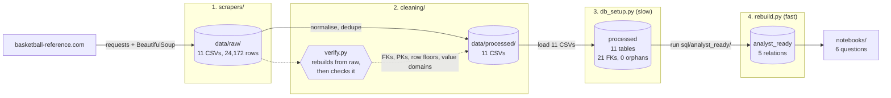
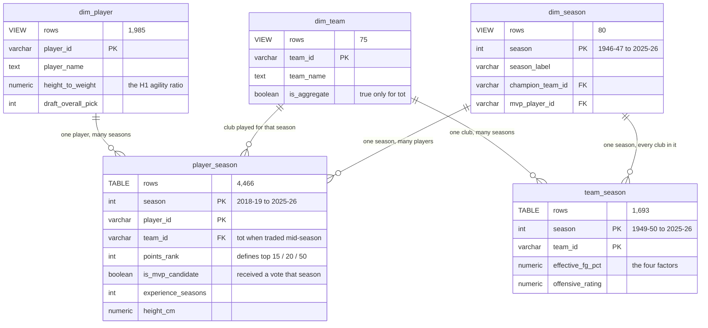

# NBA data analysis

<p align="center">
  
  
  
  
  
  
</p>

<p align="center">
  
  
  
  
  
</p>

Eleven tables scraped from [basketball-reference.com](https://www.basketball-reference.com),
cleaned in Python, loaded into PostgreSQL behind 21 enforced foreign keys, and queried from six
notebooks that answer five questions about MVP voting, champion rosters and player size.

Three of the five answers contradict the claim they were asked to test. One overturns a
recommendation the client's own metric produced, and the player it promoted went on to win MVP
twice.

<sub>Originally a group project for Quera's Data Analysis bootcamp. This repository is a
continuation of it, with my own rewritten pipeline, database and analysis. Original team:
<a href="https://github.com/AlirezaNyi">@AlirezaNyi</a> ·
<a href="https://github.com/arianmokhtariha">@arianmokhtariha</a> ·
<a href="https://github.com/mohsen20roohi-hue">@mohsen20roohi-hue</a> ·
<a href="https://github.com/MonaKheirieh">@MonaKheirieh</a> ·
<a href="https://github.com/anooshanth">@anooshanth</a></sub>

# Results

| # | Question | Verdict | Notebook |
| :-: | --- | --- | :-: |
| **D1** | Are MVP-calibre players taller than the top scorers? | No. The gap vanishes once each player is counted once. | [01](notebooks/01_D1_height.ipynb) |
| **D2** | How do champion squads differ from the top 15 scorers? | Sharply in experience. Not at all in height. | [02](notebooks/02_D2_champions.ipynb) |
| **D3** | Which point guard should the club buy? | Not the one the client's metric ranks third. | [03](notebooks/03_D3_point_guard.ipynb) |
| **H1** | Has the top 20 grown more "agile"? | No, and the metric could never have shown it. | [04](notebooks/04_H1_agility.ipynb) |
| **H2** | Has champion "innate ability" risen? | No. It fell. | [05](notebooks/05_H2_innate.ipynb) |

New to the data? [`00_data_overview.ipynb`](notebooks/00_data_overview.ipynb) covers what is in
it and where it runs out.

## D1 · Height on the MVP ballot, against the top 50 scorers

> **Verdict: no height difference survives scrutiny. The real difference is position.**

Pooled over five seasons the ballot is 2.35 cm taller, at p = 0.044. That pool is 61 rows
produced by 29 players, with Antetokounmpo and Jokić on all five ballots.

Height never changes from season to season, which makes the correction exact rather than
approximate: collapse each group to one row per player and the same test gives p = 0.46 and
identical medians of 198.1 cm. Re-weighting for position cuts what is left to 1.12 cm, below
the 2.54 cm inch grid the source publishes heights on.

What holds is spread. The ballot's interquartile range is 17.8 cm against 10.2 cm, from the
same floor of 182.9 cm. Votes go to both ends of the size range and skip the middle.


<sub>*The ballot is 42.6% point guards and 6.6% shooting guards; the top 50 is 26.8% and 24.0%.
That gap is the finding. The height difference is its shadow.*</sub>

## D2 · Champion squads, against the season's top 15 scorers

> **Verdict: experience separates them sharply. Height does not.**

| Group | n | mean experience | mean height |
| --- | ---: | ---: | ---: |
| 2024-25 Oklahoma City | 18 | 2.56 | 199.8 cm |
| 2024-25 top 15 scorers | 15 | 8.47 | 198.5 cm |
| 2025-26 New York | 17 | 4.59 | 200.4 cm |
| 2025-26 top 15 scorers | 15 | 9.47 | 198.0 cm |

Experience: p = 0.0001 and 0.002, Cliff's δ of −0.79 and −0.63, with non-overlapping bootstrap
intervals on the group means. Height: +1.35 cm and +2.43 cm, both intervals straddling zero by
about ±5 cm.

Most of that gap is structural rather than a lesson about winning. A whole squad carries
rookies at zero seasons, while the fifteen leading scorers are by construction players good
enough to have lasted. The two groups are built by different rules, and the seasons are
reported separately because Oklahoma City was young and New York was not.


<sub>*Both champion curves sit left of both scoring curves across almost the whole range. Five
of Oklahoma City's eighteen title-winning players had never played an NBA season. The least
experienced of that year's fifteen leading scorers had three.*</sub>

## D3 · Which point guard should the club buy?

> **Verdict: not the one the metric ranks third. Buy the one it ranks fourth.**

The club defines ability as "appearances on the MVP ballot, more is better". Applied exactly as
written across 2019-20 to 2023-24, it returns Dončić, Curry and Chris Paul.

Paul fails a check the metric cannot perform. Paul's last ballot as a point guard was 2021-22,
two seasons stale by the time the club is buying. In 2023-24 he was 38 years old with a PER of
14.7 across 58 games, and PER is rescaled every year so the league average lands on exactly
15.0. The metric cannot see it, because that season brought no votes.

| | ballot seasons | mean finish | total vote share | last ballot | age in 2023-24 | PER in 2023-24 |
| --- | ---: | ---: | ---: | :---: | ---: | ---: |
| Luka Dončić | 5 | 5.20 | 0.97 | 2023-24 | 24 | 28.1 |
| Stephen Curry | 3 | 6.67 | 0.46 | 2022-23 | 35 | 20.6 |
| Chris Paul | 3 | 7.00 | 0.17 | 2021-22 | 38 | 14.7 |
| Shai Gilgeous-Alexander | 2 | 3.50 | 0.69 | 2023-24 | 25 | 29.3 |


<sub>*Reputation against current form, for all thirteen candidates, using only seasons inside
the decision window. Ten of the thirteen are worse than their ballot years.*</sub>

Two seasons then happened. Gilgeous-Alexander won MVP in 2024-25 and again in 2025-26, at a PER
of 30.7 and 30.8. Paul went 14.7, then 8.1 across 16 games. Both seasons are used only to grade
the metric, never to make the pick: every name recommended is defensible from data the club had
in the summer of 2024.

One more thing the client should hear. 200 different point guards played in the window and 13
of them ever drew a vote, so the metric discards 94% of the market before it starts.

## H1 · Has the top 20 become more "agile"?

> **Verdict: no, and the metric could never have shown it.**

Agility here is height ÷ weight, the brief's own definition. The difference is −0.0034, in the
wrong direction, with Hedges' g = −0.015, and the sign flips when each player is counted once
per period instead of twice.

The decisive point sits upstream of the test. `height_to_weight` comes from the bio page and is
a single snapshot, so **0 of 929 multi-season players have a ratio that varies at all**. It can
register roster turnover and nothing else. What did move is the position mix, from 12 point
guards to 14 and from 7 centres to 4, worth +0.0206 on its own.

## H2 · Has champion "innate ability" risen?

> **Verdict: no. It fell.**

Innate ability here is experience ÷ age. It went from 0.187 to 0.129, with p = 0.1075
two-tailed and Cliff's δ = −0.235. Not enough to call the decrease reliable, and nowhere near
support for an increase.


<sub>*The two recent champions sit left of the two before them, the opposite of the claim. Every
box is outlined in gold because every squad is under thirty players: the plotting toolkit marks
small groups on the chart rather than leaving it to a footnote nobody reads.*</sub>

The original bootcamp analysis reported p ≈ 0.97 and "cannot reject" beside a t-statistic of
−4.918. A one-tailed test on a sample that moved the wrong way returns a p near 1, which
restates the direction of the effect rather than defending the null. The rebuilt notebook
reproduces that result and explains it instead of repeating it.

## Defects found on the way

`player_season.experience_seasons` is rolled back from a career total, so it cannot see a
season a player missed. Cross-checking 63 player-seasons against the roster pages found two:
Adam Flagler (stated 1, derived 0) and Alex Ducas (stated 0, derived NULL). D2 and H2 use the
roster figure instead.

The original analysis also had the sign of defensive box plus/minus backwards, which labelled
the league's worst defenders as its best. Higher is better, because it counts points prevented.

# How it is built

Every notebook follows the same shape: the question, what it actually means and what had to be
decided, where the data comes from in plain language, the query, then the statistics and charts
that turn the result into an answer. All six run top to bottom from a fresh kernel.



**Scraping** is plain `requests` and BeautifulSoup, no Selenium. Eleven table modules sit on a
shared fetcher that throttles between requests and halts the run when the site starts blocking,
rather than sailing on and writing files with holes in them.

**Cleaning** is seven per-table cleaners over a shared `normalize` module. `cleaning/verify.py`
is the acceptance test: it deletes `data/processed/`, rebuilds all eleven files, then checks
foreign keys, primary keys, row volume and the allowed vocabulary of every categorical column.
Orphans must be 0. It exits non-zero, so it can block a bad build.

**The split between stages 3 and 4 is the point of the layout.** `db_setup.py` loads eleven
CSVs and takes minutes. `rebuild.py` runs four SQL files against data already there, loads
nothing, and refuses to modify `processed`. The layer you iterate on rebuilds in seconds, and a
mistake in it cannot damage the data underneath.

# Database design



Two schemas with different jobs. `processed` is the normalised source: eleven tables, 21 foreign
keys and 22 check constraints, all enforced and none deferred. `analyst_ready` is what the
notebooks query, and each of its two facts is one join written once, so "what counts as a
player-season" is decided in a single place.

**Watch the coverage asymmetry.** `team_season` runs from 1949-50, 77 seasons. `player_season`
starts at 2018-19, eight seasons.


<sub>*Three-point attempt rate, 1979-80 to 2025-26: 3.1% to 41.5%. The spike is real. The league
shortened the line for three seasons from 1994-95, the rate went 11.7% to 21.2%, and it fell
back to 16.0% the year the line was restored.*</sub>

## Five decisions behind the schema

What comes off the site is eleven pages with no schema, no keys and no guarantees.

**Dimensions are the union of every key the facts reference**, not just of the page carrying the
descriptive fields. Building `players` from the bio page alone left 810 of 1,381 roster player
IDs parentless, and `teams` from recent seasons alone missed 17 historical and ABA codes. Rows
with no descriptive data are marked `has_bio = false` and left NULL. Nothing was deleted to make
the constraints pass; 814 players were added instead. Michael Jordan is in this database with a
name recovered from championship rosters and five MVP awards, and no bio attributes at all.

**A repeating group became its own table.** The source lists a player's positions in one field.
`players` holds one row per player, `player_positions` holds `(player_id, slot)`. That split is
what makes D3's stricter reading of "point guard" possible.

**The grain keeps a traded player's stints.** Keys of `(season, player_id, stint)` mean a
mid-season trade keeps one row per club alongside the combined `tot` row instead of one
overwriting the other. `dim_team.is_aggregate` marks `tot` so it is never counted as a club.

**Keys are the source's own, not invented.** `jordami01` is the primary key for Michael Jordan
because that is the ID Basketball Reference already uses, so a re-scrape lands on the same rows
rather than renumbering the database.

**No question has a table.** An earlier version carried one relation per deliverable
(`d1_height_sample`, `h1_agility`) and those are gone. A question baked into a schema hides its
own assumptions: "top 50 scorers" becomes a row filter nobody can see. Adding a question needs a
notebook, not a migration.

# Running it

```bash
conda env create -f environment.yml
conda activate nba-analysis
cp .env.example .env          # then fill in your local PostgreSQL details
```

Four stages, from the repository root:

```bash
python -m scrapers.run_all    # optional, ~1 hour, mostly player_bios
python -m cleaning.run_all    # seconds
python db_setup.py            # minutes; asks before dropping the database
python rebuild.py             # seconds; safe to re-run constantly
python -m cleaning.verify     # rebuilds data/processed from raw, then checks it
```

`data/raw/` and `data/processed/` are both committed, so the first two commands are optional and
a working database is two commands away.

## Repo layout

```text
scrapers/          11 table modules over config.py, fetch.py, parse.py, run_all.py
cleaning/          7 cleaners over normalize.py, run_all.py, verify.py
sql/processed/     DDL for the 11 base tables
sql/analyst_ready/ DDL for the 5 analytical relations
db_setup.py        stage 3: build `processed`, load the CSVs
rebuild.py         stage 4: build `analyst_ready` from `processed`
utils/             db_utils.py, custom_stats.py (18 functions), custom_plots.py (15 charts)
notebooks/         one per question
data/              raw/ and processed/, 11 CSVs each, both committed
docs/              data dictionary, question register, cleaning log
reports/figures/   the charts above, exported from the notebooks that made them
```

`utils/custom_stats.py` and `utils/custom_plots.py` are general-purpose toolkits of my own
rather than project code. The first picks a two-group test from its own assumption checks and
returns the effect size and interval next to the p-value.

Further reading: [`docs/analysis_questions.md`](docs/analysis_questions.md) is the register of
what is asked and what had to be decided first.
[`docs/data_dictionary.md`](docs/data_dictionary.md) covers every column of both schemas and
teaches the sport in ten minutes. [`docs/cleaning_changes.md`](docs/cleaning_changes.md) records
why the old output could not be loaded behind foreign keys at all.

# What this data cannot answer

**Nothing about winning.** There is no wins column anywhere in this database. `points_rank` is a
scoring rank, so "top 50" means the 50 highest point scorers and never the 50 best players. Rudy
Gobert finished 57th in scoring and 10th in the MVP vote in 2020-21, which is the size of that
gap in one line.

**Nothing about players before 2018-19.** Team history goes back to 1949-50. Player history does
not.

**Nothing finer than an inch.** Heights are published in whole inches, so `height_cm` lands on
23 values league-wide, 2.54 cm apart. A difference in group means can fall below that, but
nobody could see it on a court.

**Nothing about ability directly, and nothing causal.** The MVP ballot records what about a
hundred voters thought. PER, VORP and win shares model a player's contribution rather than
observe it.
