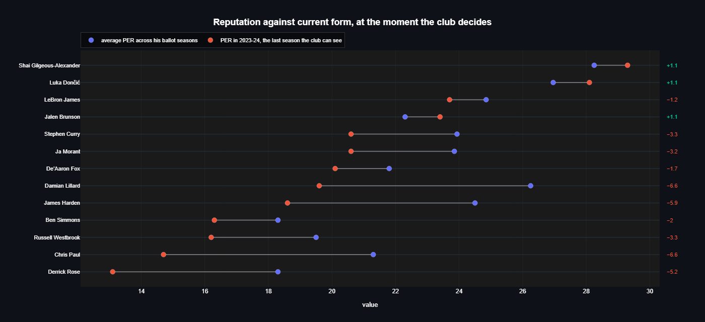
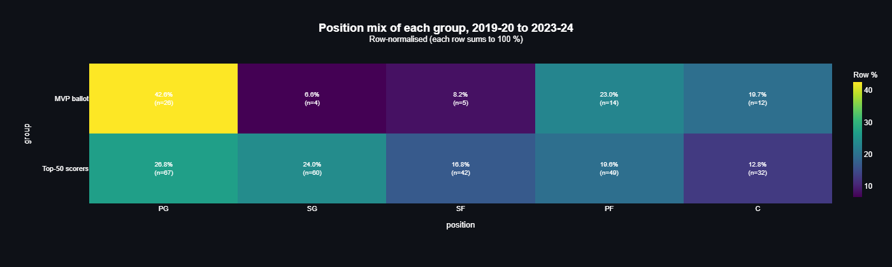
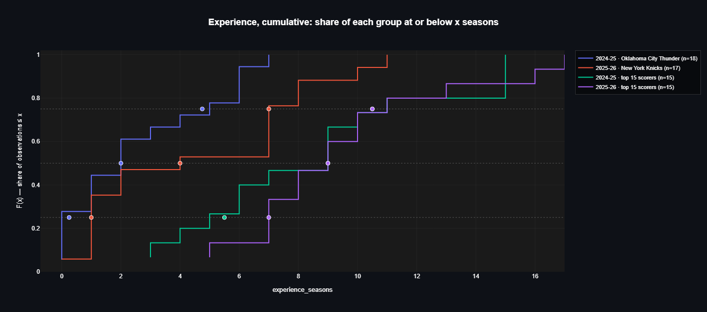
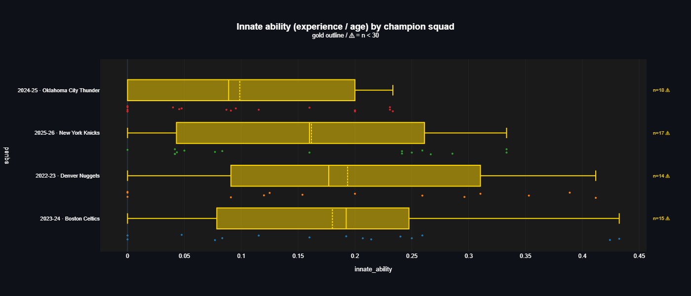
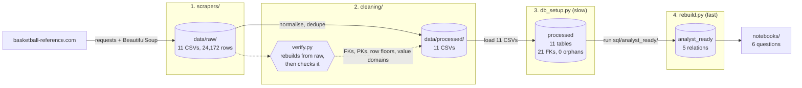
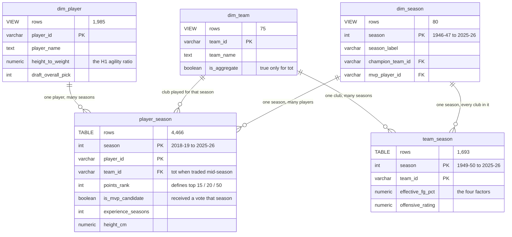
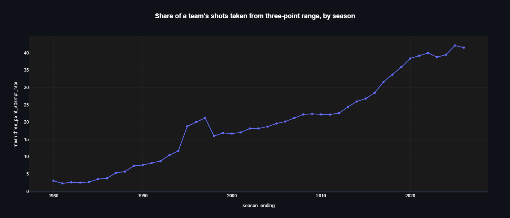

# NBA data analysis

<p align="center">
  
  
  
  
  
  
</p>

<p align="center">
  
  
  
  
  
</p>

This project scrapes eleven tables from
[basketball-reference.com](https://www.basketball-reference.com), cleans them in Python, loads
them into PostgreSQL behind 21 enforced foreign keys, and queries them from six notebooks that
answer five questions about MVP voting, champion rosters and player size.

Three of the five answers contradict the claim they were asked to test. One overturns a
recommendation the client's own metric produced, and the player it promoted went on to win
MVP twice.

## Credit

Originally a group project for Quera's Data Analysis bootcamp. This repository is a
continuation of it, containing my own rewritten pipeline, database and analysis. The
original team:
[@AlirezaNyi](https://github.com/AlirezaNyi) ·
[@arianmokhtariha](https://github.com/arianmokhtariha) ·
[@mohsen20roohi-hue](https://github.com/mohsen20roohi-hue) ·
[@MonaKheirieh](https://github.com/MonaKheirieh) ·
[@anooshanth](https://github.com/anooshanth)

---

## What the analysis found

| Question | Answer | Notebook |
| --- | --- | :-: |
| Which point guard should the club buy? | The client's own metric ranks a 38-year-old in decline third. Swapping in the player it ranked fourth would have bought back-to-back MVPs. | [03](notebooks/03_D3_point_guard.ipynb) |
| Are MVP-calibre players taller than the leading scorers? | No. A 2.35 cm gap becomes p = 0.46 once each player is counted once rather than once per season. | [01](notebooks/01_D1_height.ipynb) |
| How do champion squads differ from the leading scorers? | Sharply in experience, 2.56 seasons against 8.47. Not at all in height. | [02](notebooks/02_D2_champions.ipynb) |
| Has the top 20 grown more "agile" (height ÷ weight)? | No, and the metric could never have shown it. The ratio never varies for any of 929 multi-season players. | [04](notebooks/04_H1_agility.ipynb) |
| Has champion "innate ability" (experience ÷ age) risen? | No, it fell. The original analysis reported p ≈ 0.97 beside a t-statistic of −4.918 and missed it. | [05](notebooks/05_H2_innate.ipynb) |

Start at [`00_data_overview.ipynb`](notebooks/00_data_overview.ipynb) for what the data is and
where it runs out. The rest of this section is the detail behind those five answers.

### A client's buying metric picked the wrong third name

A club wants a point guard and defines ability as "appearances on the MVP ballot, more is
better". Applied exactly as written across 2019-20 to 2023-24, the metric returns Luka
Dončić, Stephen Curry and Chris Paul.

Paul does not survive a check the metric cannot perform. Paul's last ballot as a point guard
was 2021-22, two seasons stale by the time the club is buying. In 2023-24, the final season inside
the window, Paul was 38 years old with a PER of 14.7 across 58 games. PER is rescaled every
year so the league average lands on exactly 15.0, which makes the client's third
recommendation a below-average player. The metric could not see it, because that season came
with no votes attached.

The recommendation drops Paul and promotes Shai Gilgeous-Alexander, whom the raw count ranks
fourth on two appearances against three.

| | ballot seasons | mean finish | total vote share | last ballot | age in 2023-24 | PER in 2023-24 |
| --- | ---: | ---: | ---: | :---: | ---: | ---: |
| Luka Dončić | 5 | 5.20 | 0.97 | 2023-24 | 24 | 28.1 |
| Stephen Curry | 3 | 6.67 | 0.46 | 2022-23 | 35 | 20.6 |
| Chris Paul | 3 | 7.00 | 0.17 | 2021-22 | 38 | 14.7 |
| Shai Gilgeous-Alexander | 2 | 3.50 | 0.69 | 2023-24 | 25 | 29.3 |



*Reputation against current form, for all thirteen candidates, using only seasons inside the
decision window. Ten of the thirteen are worse than their ballot years. The three moving the
other way are the three whose most recent ballot is the most recent season.*

Two seasons then happened. Gilgeous-Alexander won MVP in 2024-25 and again in 2025-26, at a
PER of 30.7 and 30.8. Paul went 14.7, then 8.1 across 16 games. Both seasons are in the
database, and both are used only to grade the metric, never to make the pick. Every name
recommended is defensible from data the club had in the summer of 2024.

One more thing the client should be told: 200 different point guards played in the window and
13 of them ever drew a vote. The metric rules out 94% of the market before it starts.

### The height gap dissolved when the same players stopped being counted five times

Pooled across five seasons, the MVP ballot is 2.35 cm taller than the season's top 50 scorers,
at p = 0.044. That pool is 61 ballot rows produced by 29 players, and Giannis Antetokounmpo and
Nikola Jokić are on all five ballots.

Height never changes from season to season, which makes the correction exact rather than
approximate: collapse each group to one row per player and run the same test. It gives
p = 0.46, a negligible effect, and identical medians of 198.1 cm. Re-weighting what remains
onto the top 50's position mix cuts the gap to 1.12 cm. Both figures are under 2.54 cm, which
is one rung of the inch grid the source publishes heights on.

What holds is spread. The ballot's interquartile range is 17.8 cm against 10.2 cm, from the
same floor of 182.9 cm. MVP votes go to the two ends of the size range and skip the middle:
the wing positions are 40.8% of the top 50 and 14.8% of the ballot. Voters reward the player
running the offence or owning the space near the hoop, and those are the shortest and tallest
jobs on the floor.



*The same 61 ballot rows and 250 top-50 rows, split by position. The ballot is 42.6% point
guards and 6.6% shooting guards. The top 50 is 26.8% and 24.0%. That gap is the finding; the
height difference is its shadow.*

### Champion squads are young, and most of that is structural

| Group | n | mean experience | mean height |
| --- | ---: | ---: | ---: |
| 2024-25 Oklahoma City | 18 | 2.56 | 199.8 cm |
| 2024-25 top 15 scorers | 15 | 8.47 | 198.5 cm |
| 2025-26 New York | 17 | 4.59 | 200.4 cm |
| 2025-26 top 15 scorers | 15 | 9.47 | 198.0 cm |

Experience separates the groups cleanly (p = 0.0001 and 0.002, Cliff's δ of −0.79 and −0.63,
with non-overlapping bootstrap intervals on the group means). Height does nothing: +1.35 cm
and +2.43 cm, both intervals straddling zero by about ±5 cm.



*Both champion curves sit left of both scoring curves across almost the whole range. Five of
Oklahoma City's eighteen title-winning players had never played an NBA season before. The
least experienced of that year's fifteen leading scorers had three.*

Most of that gap is structural rather than a lesson about winning. A whole 17-man squad
carries rookies at zero seasons, while the fifteen leading scorers are by construction players
good enough to have survived several years. The two groups are assembled by different rules.
The seasons are reported separately rather than pooled, because Oklahoma City was young and
New York was not.

### Two claims tested, two rejected

H1 asks whether the top 20 have become more agile, with agility defined as height ÷ weight. The
difference is −0.0034, in the wrong direction, Hedges' g = −0.015, and the sign flips when
each player is counted once per period instead of twice. The decisive point sits upstream of
the test. `height_to_weight` comes from a player's bio page and is a single snapshot, so
**0 of 929 multi-season players have a ratio that varies at all**. The metric can register
roster turnover and nothing else. It could never have detected a player getting leaner. What
did move is the position mix, from 12 point guards to 14 and from 7 centres to 4, worth
+0.0206 on its own.

H2 asks whether champion squads have more "innate ability", defined as experience ÷ age. It
went down, from 0.187 to 0.129, with p = 0.1075 two-tailed and Cliff's δ = −0.235. Not enough
to call a decrease reliable, and nowhere near support for an increase.



*The two recent champions sit left of the two before them, which is the opposite of the claim.
Every box is outlined in gold because every squad is under thirty players: the plotting toolkit
marks small groups on the chart itself rather than leaving it to a footnote nobody reads.*

The original bootcamp analysis reported p ≈ 0.97 and "cannot reject" next to a t-statistic of
−4.918. A one-tailed test on a sample that moved the wrong way returns a p near 1, which
restates the direction of the effect rather than defending the null. The large effect running
opposite to the claim was hidden by the tail choice. The rebuilt notebook reproduces the
original result and explains it instead of repeating it.

### Two defects, and an inherited sign error

`player_season.experience_seasons` is rolled back from a career total scraped once, so it
cannot see a season a player missed. Cross-checking it against the source's own per-season
roster figure across 63 player-seasons found two defects, both on the 2024-25 champion:
Adam Flagler (stated 1, derived 0) and Alex Ducas (stated 0, derived NULL). D2 and H2 use the
roster figure for that reason.

Separately, the original analysis had the sign of defensive box plus/minus backwards, which
labelled the league's worst defenders as its best. Higher DBPM is better, because it counts
points prevented. Both the direction and the trap are written down in the data dictionary.

---

## Where to look

The six notebooks are linked from the table above. Each runs the same way: the question, what
it actually means and what had to be decided before it could be answered, where the data comes
from in plain language, the query, then the statistics and charts that turn the result into an
answer. They execute top to bottom from a fresh kernel.

[`docs/analysis_questions.md`](docs/analysis_questions.md) is the register of what is asked and
what had to be decided first. [`docs/data_dictionary.md`](docs/data_dictionary.md) covers every
column of both schemas, and teaches the sport in ten minutes for anyone who needs it.
[`docs/cleaning_changes.md`](docs/cleaning_changes.md) records what the cleaning rewrite
changed, and why the old output could not be loaded behind foreign keys at all.

---

## How it is built



**Scraping** is plain `requests` and BeautifulSoup, no Selenium. Eleven table-specific modules
sit on a shared fetcher that throttles between requests and halts the run when the site starts
blocking, rather than sailing on and writing files with holes in them.

**Cleaning** is seven per-table cleaners over a shared `normalize` module. `cleaning/verify.py`
is the acceptance test: it deletes `data/processed/`, rebuilds all eleven files from
`data/raw/`, then checks foreign keys, primary keys, row volume against floors, and the allowed
vocabulary of every categorical column. Orphans must be 0. It checks the data rather than a
list of expected numbers, so a re-scrape does not break it, and it exits non-zero so it can
block a bad build.

**The split between stages 3 and 4 is the point of the layout.** `db_setup.py` creates the
database, applies the DDL and loads eleven CSVs, which takes minutes. `rebuild.py` runs four
SQL files against data that is already there, loads nothing, and refuses to modify `processed`.
So the layer you iterate on while writing a query rebuilds in seconds, and a mistake in it
cannot damage the data underneath.

---

## Database design



Two schemas with different jobs. `processed` is the normalised source: eleven tables, nothing
filtered or reshaped, 21 foreign keys and 22 check constraints all enforced and none deferred.
Use it when you need the uncut truth, such as a traded player's per-club stints.
`analyst_ready` is what the notebooks query. Each of its two facts is one join written once,
so "what counts as a player-season" is decided in a single place and two notebooks cannot
quietly disagree about it.

**Watch the coverage asymmetry.** `team_season` runs from 1949-50, 77 seasons.
`player_season` starts at 2018-19, eight seasons. Seventy-seven seasons of team history is
enough to watch the sport change shape:



*Three-point attempt rate, 1979-80 to 2025-26: 3.1% to 41.5%. The spike in the middle is real.
The league shortened the three-point line for three seasons from 1994-95, the rate jumped from
11.7% to 21.2%, and it fell back to 16.0% the year the line was restored.*

### The decisions behind the schema

What comes off the site is eleven pages with no schema, no keys and no guarantees. Five
decisions turned that into something a foreign key can be enforced against.

**Each dimension is the union of every key the facts reference, not just the page carrying the
descriptive fields.** Building `players` from the bio page alone left 810 of 1,381 roster
player IDs parentless, along with 26 of the 70 MVP winners. Building `teams` from recent
seasons alone missed 17 historical and ABA codes. So each dimension is derived from every key
referenced anywhere, and rows with no descriptive data are marked `has_bio = false` or
`has_detail = false` with NULL attributes. Nothing had to be deleted to make the constraints
pass; 814 players were added instead. Michael Jordan is in this database with a name recovered
from championship rosters and five MVP awards attached, and no bio attributes at all.

**A repeating group became its own table.** The source lists a player's positions in a single
field. `players` holds one row per player and `player_positions` holds `(player_id, slot)`, so
the position a player was listed at in a given season is queryable without parsing a string at
read time. That split is what makes D3's stricter reading of "point guard" possible.

**The grain keeps a traded player's stints.** `player_season_stats` and
`player_advanced_stats` are keyed on `(season, player_id, stint)`, so a mid-season trade keeps
one row per club alongside the combined `tot` row instead of one silently overwriting the
other. `dim_team.is_aggregate` marks `tot` so it can never be miscounted as a real club.

**Keys are the source's own, not invented.** `jordami01` is the primary key for Michael Jordan
because that is the ID Basketball Reference already uses. Every primary key is a natural
composite of real identifiers, so a re-scrape lands on the same rows rather than renumbering
the database.

**No question has a table.** An earlier version of this schema carried one relation per
deliverable (`d1_height_sample`, `h1_agility`) and those are gone. A question baked into a
schema hides its own assumptions: "top 50 scorers" becomes a row filter nobody can see, and the
next question that wants a different cut has nowhere to go. Every question is answered by
querying this layer from the notebook that owns it, so adding one needs a notebook rather than
a migration.

---

## How to run it

```bash
conda env create -f environment.yml
conda activate nba-analysis
cp .env.example .env          # then fill in your local PostgreSQL details
```

Four stages, from the repository root:

```bash
python -m scrapers.run_all    # optional, ~1 hour, mostly player_bios
python -m cleaning.run_all    # seconds
python db_setup.py            # minutes; asks before dropping the database
python rebuild.py             # seconds; safe to re-run constantly
```

Both `data/raw/` and `data/processed/` are committed, so the first two commands are optional
and a working database is two commands away. To confirm the cleaning step still reproduces
itself:

```bash
python -m cleaning.verify
```

---

## Repo layout

```text
scrapers/          11 table modules over config.py, fetch.py, parse.py, run_all.py
cleaning/          7 cleaners over normalize.py, run_all.py, verify.py
sql/processed/     DDL for the 11 base tables
sql/analyst_ready/ DDL for the 5 analytical relations
db_setup.py        stage 3: build `processed`, load the CSVs
rebuild.py         stage 4: build `analyst_ready` from `processed`
utils/             db_utils.py, custom_stats.py (18 functions), custom_plots.py (15 charts)
notebooks/         one per question
data/raw/          11 scraped CSVs, committed
data/processed/    11 cleaned CSVs, committed
docs/              data dictionary, question register, cleaning log
reports/figures/   the charts embedded above, exported from the notebooks that made them
archive/           the original bootcamp submission; nothing in the pipeline reads it
```

`utils/custom_stats.py` and `utils/custom_plots.py` are general-purpose toolkits of my own
rather than project code. The first picks a two-group test from its own assumption checks and
returns the effect size and interval next to the p-value.

---

## What this data cannot answer

**Nothing about winning.** There is no wins column anywhere in this database. `points_rank` is
a scoring rank, so "top 50" means the 50 highest point scorers and never the 50 best players.
Rudy Gobert finished 57th in scoring and 10th in the MVP vote in 2020-21, which is the size of
that gap in one line.

**Nothing about players before 2018-19.** Team history goes back to 1949-50, player history
does not.

**Nothing finer than an inch.** Heights are published in whole inches, so `height_cm` lands on
23 values league-wide, 2.54 cm apart. A difference in group means can fall below that, but
nobody could see it on a court.

**Nothing about ability directly, and nothing causal.** The MVP ballot records what about a
hundred voters thought. PER, VORP and win shares model a player's contribution rather than
observe it.
