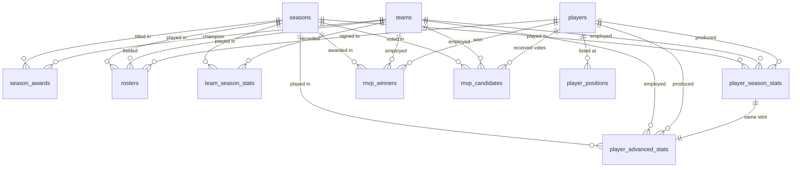
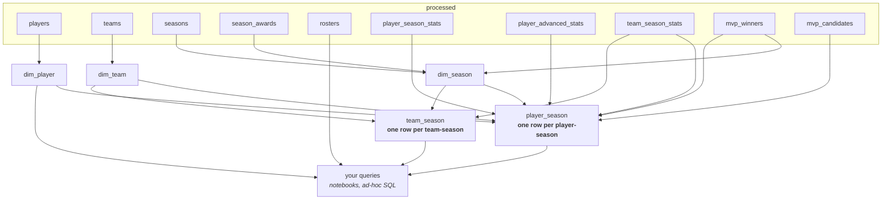

# The NBA database, explained

The complete reference for this project's PostgreSQL database (`nba_analysis`):
every table, every relationship, every column — and, for anything that is a
basketball idea rather than a plain data type, **what it actually means on a
basketball court.**

You do not need to know anything about basketball to read this. Part 0 teaches
the sport in about ten minutes, and everything after it assumes only Part 0.

**The DDL is the source of truth.** If this document and `sql/processed/00_schema.sql`
or `sql/analyst_ready/*.sql` ever disagree, the SQL is what shipped. Column
types and row counts here were read from the live database and checked against
the SQL that creates them.

**Coverage: 1946-47 through 2025-26**, with the detailed stat tables spanning the
eight seasons 2018-19 → 2025-26. Every count in this document was re-read from
the database after the most recent scrape and load. Where a figure has changed
enough that older notebooks may still assume the previous one, the old value is
called out explicitly rather than quietly replaced — see convention 6, the
`experience_seasons` note, and [the note on season windows](#one-thing-to-settle-before-you-query).

---

## Contents

- [Part 0 — Basketball in ten minutes](#part-0--basketball-in-ten-minutes)
- [Part 1 — The map](#part-1--the-map)
- [Part 2 — Seven conventions that bite](#part-2--seven-conventions-that-bite)
- [Part 3 — The `processed` schema, table by table](#part-3--the-processed-schema-table-by-table)
- [Part 4 — The `analyst_ready` schema, relation by relation](#part-4--the-analyst_ready-schema-relation-by-relation)
- [Part 5 — Glossary of the advanced statistics](#part-5--glossary-of-the-advanced-statistics)
- [Part 6 — Physical schema notes](#part-6--physical-schema-notes)

---

## Part 0 — Basketball in ten minutes

### The game

Two teams of **five players each** on court. An NBA game is **48 minutes** —
four quarters of twelve — plus five-minute overtimes if the score is tied.
Teams substitute freely, so a squad of 15 rotates through those five slots.

You score by putting the ball through the opponent's hoop:

| Shot | Worth | Notes |
| --- | ---: | --- |
| **Two-pointer** | 2 | Any shot from inside the three-point arc. |
| **Three-pointer** | 3 | Any shot from beyond the arc (~7.24 m from the hoop). |
| **Free throw** | 1 | An unguarded shot from 4.57 m, awarded after certain fouls. |

**The single most confusing term in this database: "field goal."** A *field
goal* is any shot taken during live play — so a two-pointer **and** a
three-pointer both count as field goals. Free throws are **not** field goals;
they are counted separately, because they are awarded rather than earned in
open play.

That gives the arithmetic you will see everywhere:

```
field goals attempted  =  two-pointers attempted + three-pointers attempted
points                 =  2 × 2P made  +  3 × 3P made  +  1 × FT made
```

A **possession** is one team's turn with the ball. It ends when they score,
miss and lose the rebound, or turn the ball over. Both teams get roughly the
same number of possessions in a game (~100), which is why "per 100 possessions"
is the fair way to compare players and teams — it removes the effect of a fast
or slow playing style.

### The box score — the things that get counted

After every game the league records a **box score**: a row per player with the
counts below. Almost every number in this database is one of these, either
totalled over a season or converted into a rate.

| Term | What physically happens | Good or bad? |
| --- | --- | --- |
| **Points** | The ball goes through the hoop. | Good |
| **Rebound** | A shot misses; you grab the loose ball. | Good |
| — *offensive rebound* | Your **own** team missed, and you got it back — a second chance to score. | Good, and rarer |
| — *defensive rebound* | The **opponent** missed and you ended their possession. | Good, and routine |
| **Assist** | You pass to a teammate who scores immediately off that pass. | Good |
| **Steal** | You take the ball off the opponent. | Good |
| **Block** | You swat away an opponent's shot in mid-air. | Good |
| **Turnover** | You lose the ball to the other team — bad pass, dropped ball, offensive foul. | **Bad** |
| **Personal foul** | Illegal contact. Six in a game and you are ejected. | **Bad** |
| **Games started** | You were one of the five on court at tip-off, rather than coming off the bench. | Status marker |

A **triple-double** is a single game in which a player reaches double figures
(10+) in three of those categories — almost always points, rebounds and
assists. It is basketball's shorthand for total, all-round dominance, because
it means one player controlled the scoring, the glass and the passing at once.
Most players never record one; a handful of stars average one.

### The five positions

Positions describe a role, and — this matters for three of this project's
questions — they correlate strongly with **height**. From smallest to tallest:

| Code | Name | Job | Typical height |
| --- | --- | --- | --- |
| `PG` | Point guard | Brings the ball up and runs the offence. The on-court decision-maker — the role that demands the most **basketball IQ**. Racks up assists. | ~188 cm |
| `SG` | Shooting guard | Perimeter scorer, especially three-pointers. | ~196 cm |
| `SF` | Small forward | Versatile wing — scores, defends, rebounds a bit of everything. | ~201 cm |
| `PF` | Power forward | Plays closer to the hoop, rebounds, defends bigger opponents. | ~206 cm |
| `C` | Centre | Tallest player. Protects the rim (blocks), dominates rebounds. | ~211 cm |

**Two older codes also appear: `G` (guard) and `F` (forward).** The five-way
split is modern; before roughly 1980 the league listed players simply as guard,
forward or centre, and Basketball-Reference still writes them that way. So
`players.primary_position` and `player_positions.position_code` carry seven
values, not five — `G` and `F` on 47 historic players. They are a **coarser**
label, not a missing one. The season and box-score tables only ever cover
2018-19 onwards, so their `position` column is always one of the five.

This is why the assignment's D3 question asks for a **point guard** when it
wants "high basketball IQ" — that is genuinely the thinking position. And it is
why comparing height distributions between two groups of players (D1, D2) is
really a question about which positions each group is made of.

### The season, and how it is written

The NBA regular season runs from **October to April** — so it straddles two
calendar years and is written `2024-25`. Every team plays **82 games**. Then
the best sixteen teams play a knockout tournament (the *playoffs*), ending in a
best-of-seven **Finals**. The winner is that season's **champion**.

Two recent seasons were shortened by COVID: **2019-20 played 75 games** and
**2020-21 played 72**. Any "per season" comparison across those years has to
account for that — which is exactly what `dim_season.scheduled_games` is for.

**This database always stores a season as its ending year.** `2024-25` is
stored as `2025`. See [convention 1](#part-2--seven-conventions-that-bite).

### Awards, the draft, and moving between clubs

**MVP** — Most Valuable Player, the league's top individual honour, voted on
each season by a panel of about 100 sportswriters and broadcasters. Each voter
ranks five players; the rankings are converted to points (10-7-5-3-1) and the
highest total wins. Since 2022 the trophy has been officially named the
**Michael Jordan Trophy** — which is what the assignment brief means whenever
it says "the Michael Jordan Trophy list."

**The draft** — once a year, clubs take turns selecting the best incoming young
players (mostly from American colleges). Two rounds of thirty picks. The worst
teams pick earliest, so being the **1st overall pick** means you were judged the
best prospect in the world that year. Players nobody picks are **undrafted** —
they can still sign with a club, but they were not rated. This is the basis of
the bonus draft analysis: are picks 1-5 actually better than picks 6-10?

**Trades** — a player can be swapped between clubs *in the middle of a season*.
He then has stats for two different teams in the same year. This one fact is
responsible for the most complicated part of this database's design; see
[convention 3](#part-2--seven-conventions-that-bite).

**Two-way contract (`TW`)** — a contract that splits a player's time between the
NBA club and its minor-league affiliate. A marker of a fringe roster player.
`rosters.roster_note` exists to hold this annotation, but **the current scrape
captures none: the column is `NULL` on all 6,291 rows.** Read it as "not
collected", never as "nobody is on a two-way contract."

**Leagues** — `NBA` is the modern league. `BAA` was its original name
(1946-1949). `ABA` was a rival league that ran 1967-1976 before merging into
the NBA, which is why nine seasons in this data have **two** champions.

### Where the numbers come from

Everything is scraped from [basketball-reference.com](https://www.basketball-reference.com),
the standard public archive for NBA statistics. Two kinds of numbers live there:

- **Box-score statistics** — the raw counts above. Objective; they are just
  tallies of things that happened.
- **Advanced statistics** — formulas *derived* from those counts, designed to
  answer "how good was this player, really?" in one number (PER, Win Shares,
  VORP…). These are models, not observations, and each embeds a judgement about
  what matters. [Part 5](#part-5--glossary-of-the-advanced-statistics) explains
  every one this database carries.

---

## Part 1 — The map

### How data reaches the database


Two schemas, with deliberately different jobs:

| Schema | What it is | Built by | When you use it |
| --- | --- | --- | --- |
| **`processed`** | The cleaned source data, one table per scraped CSV. Faithful, fully typed, fully constrained. Nothing is filtered or reshaped. | `python db_setup.py` (slow — it loads the data) | When you need the raw truth, the full 1947-2026 history, or a traded player's per-club splits. |
| **`analyst_ready`** | Enriched, de-duplicated facts built *from* `processed`, plus shared dimensions. General-purpose: no question has a table of its own. | `python rebuild.py` (fast, safe to re-run) | **Almost always.** This is what notebooks query. |

`rebuild.py` never touches `processed` and loads no data, so you can iterate on
`analyst_ready` all day without reloading anything.

### How the `processed` tables connect



Read the crow's-foot notation as: `||--o{` means *one row on the left, zero or
more matching rows on the right*. One season has many box scores; one box score
belongs to exactly one season.

Three tables are **dimensions** — they answer *who* (`players`), *which club*
(`teams`), *which year* (`seasons`). Everything else is a **fact**: something
that happened, pointing back at those three. Every one of those arrows is a real,
enforced foreign key, so a fact can never reference a player or team that does
not exist.

The bottom relationship is the unusual one: `player_season_stats` and
`player_advanced_stats` are joined **one-to-one on a three-column key**
(`season`, `player_id`, `stint`). They are two halves of the same fact — the raw
counts and the derived metrics — kept apart because they come from two different
source pages.

### How `analyst_ready` is derived



**Two wide facts and three dimensions — that is the whole layer.** Each fact is
one join written once, so "what counts as a player-season" is decided in exactly
one place and two notebooks cannot quietly disagree about it.

**No question has a table here.** An earlier version of this schema carried one
relation per deliverable (`d1_height_sample`, `h1_agility`, and so on); those
have been removed. A question baked into a schema hides its own assumptions —
"top 50 scorers" becomes an invisible row filter, and the next question that
wants a different cut has nowhere to go. Questions are asked *of* this layer, in
the notebook that owns them. The register of what we ask is
[`analysis_questions.md`](analysis_questions.md).

Note the last arrow: `processed.rosters` is queried **directly**. It holds the
authoritative per-season experience figure, which nothing upstream flattens.

### Every relation at a glance

**`processed` — 11 tables**

| Table | Rows | One row is… | Covers |
| --- | ---: | --- | --- |
| `teams` | 75 | one franchise (or franchise era) | all NBA/BAA/ABA history |
| `players` | 1,985 | one player | everyone referenced anywhere |
| `seasons` | 80 | one season | 1946-47 → 2025-26 |
| `player_positions` | 2,776 | one listed position for one player | the 1,981 players with a bio |
| `season_awards` | 89 | one season in one league | 1946-47 → 2025-26 |
| `rosters` | 6,291 | one player on one team in one season | champions only to 2017-18; all 30 clubs 2018-19 → 2025-26 |
| `player_season_stats` | 5,758 | one player-season **stint** | 2018-19 → 2025-26 |
| `player_advanced_stats` | 5,758 | the same stint, advanced metrics | 2018-19 → 2025-26 |
| `team_season_stats` | 1,693 | one team-season | 1949-50 → 2025-26 |
| `mvp_winners` | 71 | one season's MVP | 1955-56 → 2025-26 |
| `mvp_candidates` | 93 | one player on one MVP ballot | 2018-19 → 2025-26 |

**`analyst_ready` — 5 relations**

| Relation | Kind | Rows | One row is… |
| --- | --- | ---: | --- |
| `dim_player` | view | 1,985 | one player |
| `dim_team` | view | 75 | one franchise |
| `dim_season` | view | 80 | one season |
| `player_season` | table | 4,466 | one player-season, 2018-19 → 2025-26 |
| `team_season` | table | 1,693 | one team-season, 1949-50 → 2025-26 |

That is the whole layer, and deliberately so. It holds no question-specific
tables: see [the note above](#how-analyst_ready-is-derived) and
[`analysis_questions.md`](analysis_questions.md).

#### One thing to settle before you query

The database now carries **2025-26 as a complete season** — 82 games, champion
New York. It did not exist when this project's questions were first written, so
any question phrased **"the last two seasons"** now means **2024-25 and 2025-26**
(Oklahoma City, then New York), not the pair the original analysis used.

That is a decision, not a bug: moving the window changes published findings.
Decide per question whether to re-run against the newest season or to freeze the
window deliberately — and say which. `analysis_questions.md` is where that
choice gets recorded.

---

## Part 2 — Seven conventions that bite

These apply across the whole database and are the easiest ways to get a silently
wrong answer.

**1. `season` is the ENDING year.** The 2023-24 season is stored as `2024`.
Every table names the column `season` and every one is a foreign key to
`seasons`. Use `season_label` when you need to print `'2023-24'`.

**2. `team_id = 'tot'` is not a team.** When a player is traded mid-season,
Basketball-Reference gives him one extra *combined* row under a pseudo-club
called TOT (short for "total"). This database gives `tot` a genuine row in
`teams`, flagged `is_aggregate = true`, so those facts have something valid to
point at. **Exclude `is_aggregate` teams before counting anything per
franchise**, or you will invent a 31st club.

**3. A traded player has several rows — use `is_primary`.** This is the
consequence of convention 2, and the one that most often double-counts:

| Situation | Rows in `player_season_stats` |
| --- | --- |
| Played all season for one club | 1 row — `stint = 1`, `is_primary = true` |
| Traded once, mid-season | 3 rows — `stint = 0` (combined, `team_id = 'tot'`, `is_primary = true`), `stint = 1` (first club), `stint = 2` (second club) |

`is_primary` marks exactly one row per player-season: the combined row where one
exists, otherwise the player's only row. `where is_primary` collapses 5,758 rows
to **4,466**, one per player-season. There are 623 `tot` rows.

`analyst_ready.player_season` has already applied this filter — which is one
reason to work there rather than in `processed`. If you genuinely need the
per-club split (e.g. "how many games did he play *for Denver*?"), go to
`processed.player_season_stats` directly.

**4. Percentage scales are NOT consistent between columns.** Some are 0-1
fractions, some are 0-100 numbers. This is inherited from the two different
source pages, and it is deliberately **not** harmonised — silently converting
one would hide which page a number came from.

| Scale | Where | Example |
| --- | --- | --- |
| **0-1 fraction** | box-score shooting percentages, `true_shooting_percentage`, the attempt rates | `field_goal_pct = 0.487` means 48.7% |
| **0-100** | the advanced `*_percentage` columns, every `career_*_pct` on the bio | `usage_percentage = 28.4` means 28.4% |

The column type tells you which: `numeric(5,3)` is a fraction, `numeric(5,1)` is
a one-decimal figure. **Plotting two percentage columns on one axis without
checking this is the most common way to get a chart that is wrong by 100×.**

**5. `effective_fg_pct` and `true_shooting_percentage` can exceed 1.0.** They are
*weighted* efficiency measures, not make/miss ratios — a three-pointer counts for
more than a two — so there is no mathematical ceiling at "100%". Expected, not an
error. See the [glossary](#part-5--glossary-of-the-advanced-statistics).

**6. 4 of the 1,985 players have no bio data — and `has_bio` still matters.**
A player row exists for everyone a roster, a box score or an MVP award refers to.
Where the individual bio page was also scraped, `has_bio` is `true` and the
height, weight, birth date and draft columns are populated. Where it was not,
every one of those columns is `NULL` and a check constraint enforces it.

The bio scrape now reaches **1,981 of 1,985 players**, so this is a far smaller
caveat than it once was: the four exceptions are early MVP winners (`barklch01`,
`iversal01`, `malonka01`, `nashst01`) whose names appear nowhere in the raw data
at all. They are kept rather than deleted so the foreign keys can be genuinely
enforced instead of switched off, and so no MVP winner silently vanishes.

> **This changed.** An earlier build had only 1,175 bio pages and 814 id-only
> players — Michael Jordan among them. He now has a full bio (`SG`, 198.1 cm,
> drafted 1984), and nothing is missing a height. **Any notebook that works
> around absent heights by filtering `has_bio` is now filtering out four
> nameless rows and nothing else.**

Keep checking `has_bio` before averaging heights anyway — it is the honest guard,
and the next re-scrape may not reach as far.

**7. `rank` / `points_rank` is a SCORING rank, not a league standing.** Wherever
this project says "the top 50 players of the season," it means the 50 highest
*points scorers* — because that is the order Basketball-Reference's own season
pages use, and because this data has no wins/losses column at all. So a finding
phrased "what goes with a stronger season" is really "what goes with scoring
more," and must be presented that way.

---

## Part 3 — The `processed` schema, table by table

### Dimensions

#### `teams` — every franchise ever referenced (75 rows)

Primary key `team_id`.

| Column | Type | Null? | Meaning |
| --- | --- | --- | --- |
| `team_id` | varchar(4) | no | Basketball-Reference's lower-cased 3-letter club code (`chi` = Chicago Bulls, `lal` = LA Lakers). **PK** |
| `team_name` | text | no | Club name as the source writes it. **Not unique** — five names are shared by two franchise eras (`bal`/`blb`, `chh`/`cho`, `den`/`dnn`, `ind`/`ina`, `nyn`/`nya`), because a club that folded and was later revived, or moved between the ABA and NBA, gets a separate code. |
| `is_aggregate` | boolean | no | `true` **only for `tot`** — the traded-player season total (convention 2). Never a real club. |
| `has_detail` | boolean | no | `true` when the team has at least one row in `team_season_stats` (68 of 75). The seven without are six ABA clubs known only from championship rosters, plus `tot`. |

#### `players` — every player referenced anywhere (1,985 rows)

Primary key `player_id`. **1,981 have a scraped bio page; 4 do not** — see
convention 6. Every attribute column below is `NULL` for those 4, and a check
constraint enforces it.

| Column | Type | Null? | Meaning |
| --- | --- | --- | --- |
| `player_id` | varchar(12) | no | Basketball-Reference's player code — surname, forename, sequence number (`jordami01` = Michael Jordan). **PK** |
| `player_name` | text | yes | `NULL` for the same four MVP winners whose name appears nowhere in the raw data (`barklch01`, `iversal01`, `malonka01`, `nashst01`) — the only four without a bio. |
| `has_bio` | boolean | no | `true` when the bio page was scraped — 1,981 of 1,985. **All columns below are `NULL` when this is `false`.** |
| `primary_position` | varchar(2) | yes | Career-level position. Usually one of `PG`/`SG`/`SF`/`PF`/`C`, but **`G` or `F` for 47 pre-1980 players** the source lists only at that coarser grain (Part 0). Same as slot 1 of `player_positions`, duplicated here for convenience. Distribution: SG 491, SF 400, PG 361, PF 349, C 333, F 26, G 21, `NULL` 4. |
| `shoots` | varchar(8) | yes | Shooting hand: `right`, `left` or `both`. Ambidextrous shooters are genuinely rare and worth noting — left-handers are also a known tactical wrinkle, since defences are drilled against right-handers. |
| `height_cm` | numeric(5,1) | yes | Height in centimetres. The source publishes feet-and-inches; this is the converted value. |
| `weight_kg` | numeric(5,1) | yes | Weight in kilograms, converted from pounds. |
| `birth_year`, `birth_month`, `birth_day` | integer | yes | The source's three separate fields. |
| `birth_date` | date | yes | The same fact as one date. Both forms kept; they always agree. |
| `college` | text | yes | The US university he played for before turning professional — the traditional route into the NBA. `NULL` for the 219 players (with a bio) who never attended one: international players and those who went straight from high school. |
| `experience_seasons` | integer | yes | Total NBA seasons played **as of the scrape** — a career snapshot, not a per-season figure. For "how experienced was he *during* season X," use `player_season.experience_seasons` or `rosters.experience_seasons` instead. |
| `nba_debut_date` | date | yes | Date of his first NBA game. |
| `nba_debut_year` | integer | yes | The same, as a year. |
| `draft_year` | integer | yes | The year he was drafted (his "draft class"). |
| `draft_team_name` | text | yes | The drafting club as **free text — not a `team_id`**. The source names the club as it was called on draft night, which often no longer maps to a current franchise code. |
| `draft_round` | integer | yes | 1 or 2. `NULL` for the 579 **undrafted** players (of those with a bio) — nobody selected them. |
| `draft_round_pick` | integer | yes | Position within that round. |
| `draft_overall_pick` | integer | yes | Position overall — **1 means first player taken in the world that year.** This is what defines "top-10 pick" in the bonus draft analysis. |

**Career totals from the bio page** — present for **1,980** of the 1,981 players
with a bio. (An earlier, thinner scrape reached only 569, so anything written
against that build treats this block as sparse; it is now effectively universal.)
All of these are **career-to-date as of the scrape**, and the percentages here
are on a **0-100 scale**.

| Column | Type | Null? | Meaning |
| --- | --- | --- | --- |
| `career_games` | integer | yes | Career games played. |
| `career_points` | numeric(5,1) | yes | Career points **per game**, not a total. |
| `career_total_rebound_pct` | numeric(5,1) | yes | ⚠️ **Misnamed.** This is career rebounds **per game**, not a percentage — Jordan's `6.2` is 6.2 rebounds a game. The name comes from the original scrape and is kept so column names stay consistent end to end. |
| `career_assists_pct` | numeric(5,1) | yes | ⚠️ **Misnamed** the same way: career assists **per game**. Jordan's `5.3` is 5.3 assists a game. |
| `career_field_goal_pct` | numeric(5,1) | yes | Career FG%, 0-100. Share of open-play shots made. ~45% is respectable; centres run higher because they shoot from close range. |
| `career_three_point_pct` | numeric(5,1) | yes | Career 3P%, 0-100. ~36% is good; note that a 36% three-pointer scores more per shot than a 50% two-pointer. |
| `career_free_throw_pct` | numeric(5,1) | yes | Career FT%, 0-100. An unguarded shot, so this is close to a pure skill measure — good shooters clear 85%, poor ones sit near 50%. |
| `career_effective_fg_pct` | numeric(5,1) | yes | Career [eFG%](#efg--effective-field-goal-percentage), 0-100. |
| `career_per` | numeric(5,1) | yes | Career [PER](#per--player-efficiency-rating). 15.0 is league average. |
| `career_win_shares` | numeric(5,1) | yes | Career total [Win Shares](#ws--win-shares) — a cumulative count of wins produced. |

#### `seasons` — one row per season (80 rows, 1946-47 → 2025-26)

Primary key `season`. Exists so that every fact table has a season to point at,
including the very early seasons that have rosters but no other data.

| Column | Type | Null? | Meaning |
| --- | --- | --- | --- |
| `season` | integer | no | Ending year. `2025` = the 2024-25 season. **PK** |
| `season_label` | varchar(8) | no | `'2024-25'`, for display. |
| `start_year` | integer | no | Always `season - 1`; a check constraint enforces it. |
| `has_awards` | boolean | no | `true` when the season has a row in `season_awards`. **Currently `true` for all 80**, so it separates nothing today — kept because the awards page and the season list are scraped separately and have disagreed before. |

### Children of the dimensions

#### `player_positions` — the positions a player is listed at (2,776 rows)

Primary key `(player_id, slot)`. Foreign key `player_id → players`. Covers all
1,981 players with a bio.

Many players are listed at more than one position, because modern basketball is
positionally fluid — a tall guard may play three different roles depending on
who else is on court. This table holds one row per position instead of six
repeating columns.

Rows per slot: **1 → 1,981** (everyone), 2 → 737, 3 → 54, 4 → 3, 5 → 1. So about
37% of players carry a second position and almost nobody carries a fourth.

| Column | Type | Null? | Meaning |
| --- | --- | --- | --- |
| `player_id` | varchar(12) | no | **PK**, FK → `players` |
| `slot` | integer | no | `1` = primary position, `2` = secondary, and so on. **PK** |
| `position` | varchar(16) | no | Spelled out as the bio page writes it: `Point Guard`. |
| `position_code` | varchar(2) | no | The short code, so it joins to `player_season_stats.position`. Seven values: SG 681, SF 579, PF 561, PG 458, C 437, **F 34, G 26**. The `F`/`G` rows are pre-1980 players (Part 0) who predate the season tables entirely, so they correctly join to nothing there. |

#### `season_awards` — champion and statistical leaders per season (89 rows)

Primary key `(season, league)`. Foreign keys `season → seasons`,
`champion_team_id → teams`.

The key is composite because the nine ABA seasons (1967-76) have **two**
champions in the same year — one NBA, one ABA.

| Column | Type | Null? | Meaning |
| --- | --- | --- | --- |
| `season` | integer | no | **PK**, FK → `seasons` |
| `league` | varchar(4) | no | `NBA` (77 rows, 1949-50 → 2025-26), `ABA` (9, 1967-68 → 1975-76) or `BAA` (3, 1946-47 → 1948-49). **PK** |
| `champion_team_id` | varchar(4) | no | The club that won the Finals that season, as a real `team_id`. Never `NULL` — all 89 resolve. FK → `teams` |
| `rookie_of_the_year` | text | yes | Best first-year player. ⚠️ **Display text, not a key** — the source gives only an abbreviated name (`"S. Castle"`), which cannot be safely matched to a player. |
| `most_points` | text | yes | Season scoring leader. Display text. |
| `most_rebounds` | text | yes | Season rebounding leader. Display text. |
| `most_assists` | text | yes | Season assists leader. Display text. |
| `most_winshares` | text | yes | Season [Win Shares](#ws--win-shares) leader. Display text. |

> Where the same fact exists with a real key, use that instead: the season MVP is
> in `mvp_winners` with a proper `player_id`.

### Facts

#### `rosters` — who was on which squad (6,291 rows)

Primary key `(season, team_id, player_id)`. Foreign keys to all three dimensions.

**Read this before using the table — its coverage is deliberately uneven:**

| Seasons | Teams per season | What you get |
| --- | ---: | --- |
| 1946-47 → 2017-18 | 1 | The **champion only** (both champions in the nine ABA seasons) |
| 2018-19 → 2025-26 | 30 | **Every club** |

So the table is league-wide over exactly the eight seasons the stat tables cover,
and champions-only before that. "Average height per team per season" is a
question about the whole league from 2018-19 on, and a question about *champions*
before it. Slicing across the boundary without noticing is the easy mistake.

Its unique value: it is the only place with an **authoritative per-season
experience figure**, which is what H2 is built on.

| Column | Type | Null? | Meaning |
| --- | --- | --- | --- |
| `season` | integer | no | **PK**, FK → `seasons` |
| `team_id` | varchar(4) | no | **PK**, FK → `teams` |
| `player_id` | varchar(12) | no | **PK**, FK → `players` |
| `player_name` | text | no | Name as printed on the roster page. |
| `roster_note` | varchar(8) | yes | Intended for the annotation the source appends to a name — `TW` marks a **two-way contract**. ⚠️ **`NULL` on all 6,291 rows**: the pages this scrape reads carry no annotations. Read as "not collected", not as "none exist". |
| `position` | varchar(4) | no | As printed on the roster page, which uses looser codes than the stat pages: `G` (guard), `F` (forward), `C`, or hyphenated combinations like `F-C`. |
| `position_primary` | varchar(2) | no | First position parsed out of that string — `PG`/`SG`/`SF`/`PF`/`C`/`G`/`F`. |
| `position_secondary` | varchar(2) | yes | Second position; `NULL` when he is listed at only one. |
| `height_cm` | numeric(5,1) | no | Centimetres. Verified identical to the bio-page height for **all 6,291 rows** — the two independent sources agree completely. |
| `weight_kg` | numeric(5,1) | yes | Kilograms. Present on every row. |
| `birth_date` | date | yes | Missing for one entry. |
| `birth_country` | varchar(2) | no | Two-letter country code, parsed from the flag icon the source shows — this is the **nationality** field. The NBA has become heavily international; recent MVPs have come from Greece, Serbia, Cameroon and Slovenia. |
| `experience_seasons` | integer | no | Seasons of NBA experience **before this one**. **`0` means rookie** (the source writes `R`). This is the authoritative per-season figure. |
| `college` | text | yes | Missing for 735 entries. |

#### `player_season_stats` — season box-score totals per player (5,758 rows)

Primary key `(season, player_id, stint)`. Foreign keys `season → seasons`,
`player_id → players`, `team_id → teams`.

Seasons 2018-19 through 2025-26 — eight seasons, between 651 and 812 stint rows
each. **These are season TOTALS, not per-game
averages** — divide by `games_played` yourself, or use `analyst_ready.player_season`,
which has already done it. Read convention 3 on `stint` before querying.

| Column | Type | Null? | Meaning |
| --- | --- | --- | --- |
| `season` | integer | no | **PK**, FK → `seasons` |
| `player_id` | varchar(12) | no | **PK**, FK → `players` |
| `stint` | integer | no | `0` = combined season total, `1..n` = one row per club in source order. **PK** |
| `is_primary` | boolean | no | Marks the single row per player-season to use for per-player analysis (convention 3). |
| `team_id` | varchar(4) | no | FK → `teams`; `'tot'` on the combined rows. A check constraint requires `stint = 0` and `team_id = 'tot'` to always agree. |
| `rank` | integer | no | The source page's display order — which is the **ranking by total points scored** (convention 7). |
| `age` | integer | no | Age **during that season**. The only correct age for a per-season comparison. |
| `position` | varchar(2) | no | Position actually played **that season**. May differ from `players.primary_position`, which is career-level. |
| `games_played` | integer | no | Games he appeared in, out of a maximum of 82 (75 in 2019-20, 72 in 2020-21 — both COVID-shortened). |
| `games_started` | integer | no | Of those, how many he started rather than coming off the bench — a status marker. Never exceeds `games_played` (enforced). |
| `minutes_played` | integer | no | Total minutes on court across the season. |
| `field_goals_made` / `_attempted` | integer | no | **Shots from open play — twos and threes combined.** Free throws excluded. Made never exceeds attempted (enforced, all four shot types). |
| `field_goal_pct` | numeric(5,3) | yes | 0-1 fraction. ⚠️ **`NULL`, not `0`, when he took no shots of that kind** — zero attempts has no percentage. `NULL` for 43 rows. |
| `three_pointers_made` / `_attempted` | integer | no | Shots from beyond the arc. Volume here has exploded league-wide since ~2015; it is the defining tactical shift of the modern game. |
| `three_point_pct` | numeric(5,3) | yes | 0-1 fraction; `NULL` for 355 rows with no attempts. |
| `two_pointers_made` / `_attempted` | integer | no | Shots inside the arc. Always equals field goals minus three-pointers. |
| `two_point_pct` | numeric(5,3) | yes | 0-1 fraction. Higher than 3P% for almost everyone, since the shot is closer. |
| `effective_fg_pct` | numeric(5,3) | yes | [eFG%](#efg--effective-field-goal-percentage) — field-goal percentage weighted for a three being worth more than a two. **Can exceed 1.0.** |
| `free_throws_made` / `_attempted` | integer | no | Unguarded shots awarded after a foul, worth 1 point each. |
| `free_throw_pct` | numeric(5,3) | yes | 0-1 fraction; `NULL` for 371 rows. |
| `offensive_rebounds` | integer | no | Rebounds of his **own team's** misses — each one is a fresh possession, so they are scarce and valuable. |
| `defensive_rebounds` | integer | no | Rebounds of the **opponent's** misses — routine, and far more numerous. |
| `total_rebounds` | integer | no | The two added together. Always equals `offensive + defensive`. |
| `assists` | integer | no | Passes that directly produced a teammate's basket. The point guard's headline statistic. |
| `steals` | integer | no | Times he took the ball off the opposition. |
| `blocks` | integer | no | Opponent shots he swatted away in flight. Concentrated among tall players near the hoop. |
| `turnovers` | integer | no | Times he lost the ball to the opposition. **Bad** — the only counting stat here you want to be low. |
| `personal_fouls` | integer | no | Illegal contact committed. Six in a game means ejection, so high-foul players spend less time on court. |
| `points` | integer | no | Total points scored. |
| `triple_doubles` | integer | no | Games with 10+ in three box-score categories — the marker of all-round dominance (Part 0). Zero for most players. |

#### `player_advanced_stats` — the same stints, derived metrics (5,758 rows)

Primary key `(season, player_id, stint)`. Foreign key
`(season, player_id, stint) → player_season_stats`, plus the three dimension keys.

Same rows, same grain, same `stint`/`is_primary`/`tot` rules as the box-score
table. The composite foreign key means an advanced row **can never exist without
its box-score row**, so the two always join 1:1.

`age`, `position`, `games` and `minutes_played` are deliberately **not** repeated
here — they were verified identical to `player_season_stats`. Join for them.

> **Scale warning:** every `*_percentage` column below is on a **0-100** scale,
> unlike the 0-1 shooting fractions in the box-score table (convention 4).

Full explanations of what each metric measures are in
[Part 5](#part-5--glossary-of-the-advanced-statistics).

| Column | Type | Null? | Meaning |
| --- | --- | --- | --- |
| `season`, `player_id`, `stint` | | no | **PK**, FK → `player_season_stats` |
| `is_primary` | boolean | no | As in the box-score table. |
| `team_id` | varchar(4) | no | FK → `teams`; `'tot'` on the combined rows. |
| `player_efficiency_rate` | numeric(5,1) | no | [PER](#per--player-efficiency-rating) — all-in-one per-minute production score. **League average is 15.0 by construction, every season.** |
| `true_shooting_percentage` | numeric(5,3) | yes | [TS%](#ts--true-shooting-percentage) — the best single shooting-efficiency number: counts twos, threes and free throws together. **0-1 fraction; can exceed 1.0.** |
| `three_point_attempt_rate` | numeric(5,3) | yes | Share of his shots that were three-pointers. `0.5` means half. A style descriptor, not a quality one. `NULL` when he took no shots. |
| `free_throw_attempt_rate` | numeric(5,3) | yes | Free-throw attempts per field-goal attempt — how often he draws fouls, which comes from attacking the hoop aggressively. Not capped at 1. |
| `offensive_rebound_percentage` | numeric(5,1) | no | [ORB%](#rebound-assist-steal-block-and-turnover-percentages) — share of available offensive rebounds he collected while on court, 0-100. |
| `defensive_rebound_percentage` | numeric(5,1) | no | DRB%, same idea, 0-100. |
| `total_rebound_percentage` | numeric(5,1) | no | TRB%, both combined, 0-100. |
| `assist_percentage` | numeric(5,1) | no | [AST%](#rebound-assist-steal-block-and-turnover-percentages) — share of his teammates' baskets that he assisted while on court, 0-100. Point guards dominate this. |
| `steal_percentage` | numeric(5,1) | no | STL% — share of opponent possessions he ended with a steal, 0-100. |
| `block_percentage` | numeric(5,1) | no | BLK% — share of opponent two-point attempts he blocked, 0-100. Centres dominate this. |
| `turnover_percentage` | numeric(5,1) | yes | TOV% — turnovers per 100 possessions he used. **Lower is better.** `NULL` for 35 rows. |
| `usage_percentage` | numeric(5,1) | no | [USG%](#usg--usage-percentage) — share of his team's possessions he finished while on court. **20% is exactly average** (five players share 100%); 30%+ marks a primary option. |
| `offensive_win_shares` | numeric(5,1) | no | Wins credited to his offence. **Can be negative.** |
| `defensive_win_shares` | numeric(5,1) | no | Wins credited to his defence. |
| `win_shares` | numeric(5,1) | no | [WS](#ws--win-shares) — the two added. Roughly "how many of his team's wins were his." |
| `win_shares_per_48_minutes` | numeric(5,3) | no | WS normalised for playing time. `.100` is league average, `.200+` is elite. |
| `offensive_box_plus_minus` | numeric(5,1) | no | [OBPM](#bpm--box-plusminus) — points per 100 possessions above a league-average player, offence only. |
| `defensive_box_plus_minus` | numeric(5,1) | no | DBPM — the defensive counterpart. ⚠️ **Higher is better** (more points prevented), which is easy to get backwards. |
| `box_plus_minus` | numeric(5,1) | no | BPM — the two combined. `0.0` is exactly league average. |
| `value_over_replacement_player` | numeric(5,1) | no | [VORP](#vorp--value-over-replacement-player) — total value above a freely-available bench player, across the whole season. A cumulative figure, so playing time counts. |

#### `team_season_stats` — team totals per season (1,693 rows)

Primary key `(season, team_id)`. Foreign keys `season → seasons`, `team_id → teams`.

Seasons 1949-50 through 2025-26, NBA clubs only (the ABA teams appear in
`teams` and `rosters` but have no season totals). The same box-score columns as
the player table, aggregated to the club. **Two things to know:**

1. **Every season here has now been played.** All 30 rows of 2025-26 carry a
   full 82 games, and no row anywhere has `games = 0`. Earlier builds kept the
   newest season as a `games = 0` placeholder, so older notebooks may still
   open with `where games > 0` — that filter is now a harmless no-op rather
   than a necessary correction.
2. **`NULL` marks an era, not a gap in the scrape.** The league simply did not
   record every statistic from the start — steals and blocks were not official
   until 1973-74, and the three-point line did not exist until 1979-80:

   | Column | League-wide from | Stray earlier rows |
   | --- | --- | --- |
   | `total_rebounds` | 1950-51 | — |
   | `minutes_played` | 1964-65 | — |
   | `turnovers` | 1970-71 | one club in each of 1968-69, 1969-70 |
   | `steals`, `blocks` | 1973-74 | one club in 1970-71, two in 1971-72 and 1972-73 |
   | `offensive_rebounds`, `defensive_rebounds` | 1973-74 | — |
   | `three_pointers_made` / `_attempted` / `three_point_pct` | 1979-80 | — |

   ⚠️ Those stray rows are why **`min(season) where col is not null` is the wrong
   way to find when a statistic starts** — it returns 1970-71 for steals. Test
   completeness per season (`count(*) = count(col)`) instead.

   One further row (`blb`, 1954-55) has no statistics at all — the franchise
   folded mid-season. It is the only `NULL` in columns like `points` and `games`.

| Column | Type | Null? | Meaning |
| --- | --- | --- | --- |
| `season` | integer | no | **PK**, FK → `seasons` |
| `team_id` | varchar(4) | no | **PK**, FK → `teams` |
| `rank` | integer | no | The source page's display rank within the season — again a **scoring** order, not a standing (convention 7). |
| `games` | integer | yes | Games played. `NULL` only for `blb` 1954-55; `0` is permitted by the check constraint but no row carries it. |
| `minutes_played` | integer | yes | Team minutes — roughly `games × 240` (five players × 48 minutes), plus overtime. |
| `field_goals_made` … `points` | integer / numeric | yes | The same 22 box-score columns as `player_season_stats`, summed over the squad. Percentages are `numeric(5,3)` 0-1 fractions. `two_pointers_*` and `three_pointers_*` are present; there is no `effective_fg_pct` or `triple_doubles` at team level. |

#### `mvp_winners` — the Michael Jordan Trophy (71 rows)

Primary key `(season, league)`. Foreign keys `season → seasons`,
`player_id → players`, `team_id → teams`.

One row per season MVP from 1955-56 to 2025-26, with the **per-game** line the
award was won on. Counting `player_id` gives a player's career MVP tally.

| Column | Type | Null? | Meaning |
| --- | --- | --- | --- |
| `season` | integer | no | **PK**, FK → `seasons` |
| `league` | varchar(4) | no | `NBA` for every current row. **PK** |
| `player_id` | varchar(12) | no | FK → `players`. **37 distinct players won these 71 awards.** Only 4 of them lack a bio, covering 6 rows — so nearly every historic MVP now has a height on file. (An earlier build had 26 without a bio across 52 rows; anything written against that assumption is now over-cautious.) |
| `team_id` | varchar(4) | no | The club he was with. FK → `teams` |
| `age` | integer | no | Age during the MVP season. |
| `games` | integer | no | Games played. |
| `minutes_per_game` | numeric(5,1) | no | **Per-game averages, not totals**, unlike `player_season_stats`. |
| `points_per_game` | numeric(5,1) | no | The headline number in most MVP arguments. |
| `rebounds_per_game` | numeric(5,1) | no | |
| `assists_per_game` | numeric(5,1) | no | |
| `steals_per_game`, `blocks_per_game` | numeric(5,1) | yes | ⚠️ **`NULL` for 1955-56 → 1972-73** — the league did not record them before 1973-74. 18 rows. |
| `field_goal_pct`, `free_throw_pct` | numeric(5,3) | no | 0-1 fractions. |
| `three_point_pct` | numeric(5,3) | yes | ⚠️ **`NULL` for 1955-56 → 1978-79** — there was no three-point line before 1979-80. 24 rows. |
| `win_shares` | numeric(5,1) | no | [Win Shares](#ws--win-shares) that season. |
| `win_shares_per_48` | numeric(5,3) | no | Normalised for playing time. |

#### `mvp_candidates` — the MVP ballot (93 rows)

Primary key `(season, player_id)`. Foreign keys `season → seasons`,
`player_id → players`, `team_id → teams`.

Everyone who received at least one MVP vote, 2018-19 → 2025-26 — between 8 and
15 names a season. **The winner also appears here, at rank 1** — the two tables
overlap by design.

Because this table is a *list* of honoured players (rather than a single winner)
and covers the seasons this project studies, it is what "the Michael Jordan
Trophy list" means throughout this project.

| Column | Type | Null? | Meaning |
| --- | --- | --- | --- |
| `season` | integer | no | **PK**, FK → `seasons` |
| `player_id` | varchar(12) | no | **PK**, FK → `players` |
| `rank` | integer | no | Final ballot position. `1` = won the award. |
| `tie` | boolean | no | `true` when the position was shared. The source writes `"10T"`; the number and the tie flag are stored separately so `rank` stays numeric. |
| `age` | integer | no | Age that season. |
| `team_id` | varchar(4) | yes | FK → `teams`. Nullable because the source has listed a candidate without a club before; **all 93 current rows resolve.** |
| `first_place_votes` | integer | no | How many of the ~100 voters ranked him first. |
| `points_won` | integer | no | Voting points earned (10 for a 1st-place vote, then 7-5-3-1). Never exceeds `points_max` (enforced). |
| `points_max` | integer | no | The maximum available that season — i.e. what a unanimous winner would score. |
| `share` | numeric(5,3) | no | `points_won / points_max`. **`1.0` would be a unanimous MVP** — it has happened once in NBA history (2015-16), which is outside this window, so no row here reaches it. The cleanest single measure of how strong a candidacy was. |
| `games` | integer | no | Games played. |
| `mp`, `pts`, `trb`, `ast`, `stl`, `blk` | numeric(5,1) | no | **Per-game** minutes, points, rebounds, assists, steals, blocks — abbreviated exactly as the source names them. |
| `fg_pct`, `ft_pct` | numeric(5,3) | no | 0-1 fractions. |
| `three_pct` | numeric(5,3) | yes | `NULL` for one candidate with no attempts. |
| `ws` | numeric(5,1) | no | [Win Shares](#ws--win-shares). |
| `ws_per_48` | numeric(5,3) | no | Win Shares per 48 minutes. |

---

## Part 4 — The `analyst_ready` schema, relation by relation

Built by `python rebuild.py`, which runs `sql/analyst_ready/*.sql` in order.
Fast (seconds) and safe to re-run: it drops and rebuilds `analyst_ready` from
scratch every time, and never touches `processed`.

**This layer answers no question by itself, on purpose.** It exists to make
querying easy: two wide facts with the joins and derived features already done,
over three shared dimensions. Every question is a query written against it —
see [`analysis_questions.md`](analysis_questions.md) for the register of what
this project asks, and why each definition was chosen.

Both facts carry `season` and the relevant ids straight through from the
dimensions rather than re-deriving them, so joining them to each other, back to
`processed`, or into a query of your own is always safe.

### Shared dimensions

#### `dim_player` — one row per player (view, 1,985 rows)

A readability rename over `processed.players`, plus one derived column.

| Column | Type | Meaning |
| --- | --- | --- |
| `player_id`, `player_name` | varchar(12), text | |
| `has_bio` | boolean | Convention 6. `false` for just 4 of 1,985; every bio column below is `NULL` for them. |
| `primary_position` | varchar(2) | Career-level position; `G`/`F` for 47 pre-1980 players (Part 0). |
| `shoots` | varchar(8) | `right`, `left`, `both`. |
| `height_cm`, `weight_kg` | numeric(5,1) | |
| `height_to_weight` | numeric | `height_cm ÷ weight_kg`, 4 dp. **This project's stand-in for "agility"** (H1's own definition): more centimetres per kilogram means a leaner frame. ~2.2 for a guard, ~1.9 for a centre. `NULL` if either half is missing. |
| `birth_date`, `birth_year` | date, integer | |
| `college` | text | `NULL` for the 219 bio'd players who never attended one. |
| `career_experience_seasons` | integer | Total NBA seasons **as of the scrape** — a career snapshot. For "experience *during* season X" use `player_season.experience_seasons`. |
| `nba_debut_year` | integer | |
| `draft_year`, `draft_round`, `draft_overall_pick` | integer | `NULL` for undrafted players. |
| `draft_team_name` | text | Free text, not a key. |
| `career_games` | integer | |
| `career_points_per_game` | numeric(5,1) | Renamed from `processed.players.career_points` to say what it is. |
| `career_per` | numeric(5,1) | Career [PER](#per--player-efficiency-rating). |
| `career_win_shares` | numeric(5,1) | Career [Win Shares](#ws--win-shares). |

#### `dim_team` — one row per franchise (view, 75 rows)

A thin pass-through of `processed.teams`.

| Column | Type | Meaning |
| --- | --- | --- |
| `team_id` | varchar(4) | 3-letter club code. |
| `team_name` | text | |
| `is_aggregate` | boolean | `true` only for `tot`. **Not a real club** — exclude before counting per franchise. |
| `has_detail` | boolean | `true` when the team has season stats on file (68 of 75). |

#### `dim_season` — one row per season (view, 80 rows)

`processed.seasons` joined out to that season's champion and MVP, so the two
facts every question keeps asking for are one column away.

| Column | Type | Meaning |
| --- | --- | --- |
| `season` | integer | Ending year. |
| `season_label` | varchar(8) | `'2024-25'`. |
| `start_year` | integer | Always `season - 1`. |
| `champion_team_id` | varchar(4) | That season's **NBA** champion. The ABA champion is deliberately excluded so a season stays one row. `NULL` for 3 very early seasons. |
| `champion_team_name` | text | Same, as a name. |
| `mvp_player_id` | varchar(12) | That season's MVP. `NULL` before the award existed (pre-1955-56). |
| `mvp_player_name` | text | Same, as a name. |
| `scheduled_games` | integer | **The longest schedule any team played that season** — 82 normally, 75 in 2019-20 and 72 in 2020-21 (both COVID-shortened). The fair denominator for "how much of the season was this player available for" when his own club is unknown. |
| `has_been_played` | boolean | `true` once `scheduled_games` is known. **Now `true` for every season including 2025-26**, which is complete at 82 games. |

The eight seasons the analysis covers, for reference:

| Season | Schedule | Champion | MVP |
| --- | ---: | --- | --- |
| 2018-19 | 82 | Toronto Raptors | Giannis Antetokounmpo |
| 2019-20 | 75 | Los Angeles Lakers | Giannis Antetokounmpo |
| 2020-21 | 72 | Milwaukee Bucks | Nikola Jokić |
| 2021-22 | 82 | Golden State Warriors | Nikola Jokić |
| 2022-23 | 82 | Denver Nuggets | Joel Embiid |
| 2023-24 | 82 | Boston Celtics | Nikola Jokić |
| 2024-25 | 82 | Oklahoma City Thunder | Shai Gilgeous-Alexander |
| 2025-26 | 82 | New York Knicks | Shai Gilgeous-Alexander |

### `player_season` — the shared base fact (table, 4,466 rows)

**Grain: one row per player per season, 2018-19 through 2025-26.** Not itself
the answer to a question — it is the single wide table a player question is
then a filter or an aggregate of, so "what counts as a player-season" is decided
here and nowhere else. The traded-player duplication of convention 3 is already
resolved: `where is_primary`.

**Keys and context**

| Column | Type | Meaning |
| --- | --- | --- |
| `season`, `season_label` | integer, varchar(8) | Convention 1. |
| `player_id`, `player_name` | varchar(12), text | |
| `team_id`, `team_name` | varchar(4), text | His club that season, or `tot` for a traded player. |
| `is_multi_team_season` | boolean | `true` when this is a traded player's combined line. |
| `is_on_champion_team` | boolean | `true` when he finished the season on that year's NBA champion. |

**Who he was that season**

| Column | Type | Meaning |
| --- | --- | --- |
| `age` | integer | Age **during** that season — not a current age. This is what makes a fair past-vs-recent comparison possible. |
| `position` | varchar(2) | Position actually played that season (box-score page). |
| `primary_position` | varchar(2) | Career-level position (bio page) — may differ. |
| `points_rank` | integer | Scoring-volume rank that season. **This is how the project defines "top 15/20/50" throughout** (convention 7). |

**Playing time and availability**

| Column | Type | Meaning |
| --- | --- | --- |
| `games_played`, `games_started`, `minutes_played` | integer | Season totals. |
| `team_games` | integer | Games his club played that season; for a traded player, the league's full schedule length instead. |
| `games_basis` | text | `'own_team'` or `'league_schedule'` — which denominator `team_games` used. 623 rows in all, between 60 and 97 players a season, are on the league basis. |
| `availability` | numeric | `games_played ÷ team_games`, 4 dp. **`1.0` = never missed a game.** Two rows in eight seasons sit a shade above 1.0 (Mikal Bridges 2022-23 at 1.0122, Buddy Hield 2023-24 at 1.0244) — a traded player can exceed the schedule when his two clubs were at different points in theirs. Genuine, not an error. |

**Box score — season totals, then per-game**

| Column | Type | Meaning |
| --- | --- | --- |
| `points`, `total_rebounds`, `assists`, `steals`, `blocks`, `turnovers`, `triple_doubles` | integer | Season totals. |
| `points_per_game`, `rebounds_per_game`, `assists_per_game`, `minutes_per_game` | numeric | The same, divided by `games_played`, 2 dp. **`points_per_game` is the number a casual fan quotes** — around 25 marks a star, 30+ a scoring champion. |

**Shooting — 0-1 fractions**

| Column | Type | Meaning |
| --- | --- | --- |
| `field_goal_pct`, `three_point_pct`, `free_throw_pct` | numeric(5,3) | `NULL` when he attempted none of that shot type, not `0`. |
| `effective_fg_pct` | numeric(5,3) | [eFG%](#efg--effective-field-goal-percentage). **Can exceed 1.0.** |

**Advanced metrics** — `*_percentage` columns are **0-100**; see [Part 5](#part-5--glossary-of-the-advanced-statistics)

| Column | Type | Meaning |
| --- | --- | --- |
| `player_efficiency_rate` | numeric(5,1) | [PER](#per--player-efficiency-rating); 15.0 = league average. |
| `true_shooting_percentage` | numeric(5,3) | [TS%](#ts--true-shooting-percentage); 0-1 fraction, can exceed 1.0. |
| `usage_percentage` | numeric(5,1) | [USG%](#usg--usage-percentage); 0-100, ~20 is average. |
| `total_rebound_percentage`, `assist_percentage`, `steal_percentage`, `block_percentage` | numeric(5,1) | [Share-of-available metrics](#rebound-assist-steal-block-and-turnover-percentages), 0-100. |
| `turnover_percentage` | numeric(5,1) | Turnovers per 100 plays used. **Lower is better.** |
| `win_shares` | numeric(5,1) | [WS](#ws--win-shares) — estimated wins he was worth. |
| `win_shares_per_48_minutes` | numeric(5,3) | Normalised for playing time. |
| `offensive_box_plus_minus`, `defensive_box_plus_minus`, `box_plus_minus` | numeric(5,1) | [BPM](#bpm--box-plusminus) — points per 100 possessions above league average. `0.0` = average. |
| `value_over_replacement_player` | numeric(5,1) | [VORP](#vorp--value-over-replacement-player) — cumulative value above a bench-level player. |

**Bio attributes** — every row here has `has_bio = true`, so none of these are
missing for want of a bio page.

| Column | Type | Meaning |
| --- | --- | --- |
| `has_bio`, `height_cm`, `weight_kg`, `height_to_weight` | | As in `dim_player`. All 4,466 rows carry a height. |
| `college`, `draft_year`, `draft_round`, `draft_overall_pick` | | As in `dim_player`. |
| `career_experience_seasons` | integer | Career snapshot, not per-season. |
| `experience_seasons` | integer | Seasons of experience **before** this one; `0` = rookie year. ⚠️ **The weakest column in this table — read the note below before using it.** |

> #### ⚠️ `experience_seasons` is derived, and it degrades with age
>
> There is no per-season experience figure on the box-score page, so this column
> is **rolled back** from the career total: `career_experience − (latest season −
> this season)`. That arithmetic is exact only if the player appeared in every
> intervening season. It counts seasons *played*, not calendar years, so anyone
> who missed a full year comes out **too low**, and the error grows the further
> back you look.
>
> Measured against `rosters.experience_seasons` — the authoritative per-season
> figure the source states directly — the two now disagree on **640 of 3,390
> comparable rows (19%)**, by 1 to 7 seasons:
>
> | Season | Compared | Disagree |
> | --- | ---: | ---: |
> | 2018-19 | 201 | 54 |
> | 2019-20 | 258 | 81 |
> | 2020-21 | 327 | 105 |
> | 2021-22 | 392 | 120 |
> | 2022-23 | 439 | 97 |
> | 2023-24 | 512 | 105 |
> | 2024-25 | 601 | 78 |
> | 2025-26 | 660 | **0** |
>
> The gradient is the tell: the newest season needs no roll-back and agrees
> perfectly, and every step further back compounds. An earlier build asserted
> the two agreed *exactly*; that was true when the data stopped at 2024-25 and
> the roster table covered far fewer players, and it is no longer true.
>
> **Coverage is also thin and skewed the same way:** `NULL` on 1,437 of the
> 4,466 rows (546 distinct players), because 1,248 bio pages omit the field
> entirely and nothing is invented to fill it. By season the gaps run 347 (of
> 530) in 2018-19 down to 1 (of 582) in 2025-26.
>
> **Prefer `rosters.experience_seasons` whenever the player is on a roster row**
> — which, from 2018-19 on, is the whole league.

### `team_season` — the shared team fact (table, 1,693 rows)

**Grain: one row per club per season, 1949-50 through the latest season.** The
team-side counterpart to `player_season`, and like it, an answer to no question
on its own. Raw counts are not comparable between clubs or eras — a team that
plays fast attempts more of everything — so this table carries the derived
rates that make a comparison mean something.

Nothing is filtered to a window; the full history is here and a question
narrows it. The `tot` pseudo-club never appears, having no team totals to
aggregate.

**Two `NULL` patterns, both honest rather than filled:**

- **The era did not record the input.** No three-point data before 1979-80, no
  offensive rebounds, steals or blocks before 1973-74. Any derived column
  needing a missing input is `NULL` — `effective_fg_pct` is populated for 1,314
  of the 1,693 rows, `offensive_rating` for 1,433.
- **`games` is `NULL` or `0`.** One row (`blb`, 1954-55) has no statistics at
  all — the franchise folded mid-season. Every rate divides through `nullif`,
  so such a row yields `NULL` rather than an error. `has_been_played` marks it.

**Keys and context**

| Column | Type | Meaning |
| --- | --- | --- |
| `season`, `season_label` | integer, varchar(8) | Convention 1. |
| `team_id`, `team_name` | varchar(4), text | |
| `is_champion` | boolean | `true` for that season's NBA champion. |
| `points_rank` | integer | The source page's rank within the season, which is by **total points scored**. ⚠️ **Not a league standing** (convention 7) — this database has no wins column anywhere. |
| `has_been_played` | boolean | `games > 0`. `NULL` for the one row with no statistics at all. |

**Raw season totals** — carried straight through from `processed.team_season_stats`

| Column | Type | Meaning |
| --- | --- | --- |
| `games`, `minutes_played`, `points` | integer | Team minutes run roughly `games × 240` (five players × 48 minutes), plus overtime. |
| `field_goals_made` / `_attempted` | integer | Open-play shots — twos and threes together, free throws excluded. |
| `three_pointers_made` / `_attempted` | integer | |
| `two_pointers_made` / `_attempted` | integer | |
| `free_throws_made` / `_attempted` | integer | |
| `offensive_rebounds`, `defensive_rebounds`, `total_rebounds` | integer | |
| `assists`, `steals`, `blocks`, `turnovers`, `personal_fouls` | integer | |

**Shooting percentages** — 0-1 fractions, as the source gives them

| Column | Type | Meaning |
| --- | --- | --- |
| `field_goal_pct`, `three_point_pct`, `two_point_pct`, `free_throw_pct` | numeric(5,3) | |

**Per-game rates**

| Column | Type | Meaning |
| --- | --- | --- |
| `points_per_game`, `rebounds_per_game`, `assists_per_game`, `turnovers_per_game` | numeric | Totals ÷ `games`, 1 dp. |

**Possessions and efficiency**

| Column | Type | Meaning |
| --- | --- | --- |
| `estimated_possessions` | numeric | `FGA − ORB + TOV + 0.44 × FTA`. The standard approximation, since the source publishes no possession count. The `0.44` is the accepted estimate of how many free-throw attempts actually end a possession — an and-one, or the first of two, does not. |
| `possessions_per_game` | numeric | The usual proxy for **how fast a club plays**. |
| `offensive_rating` | numeric | **Points per 100 possessions** — the era-neutral way to say "good offence." This is the column that separates a genuinely efficient team from one that merely plays fast and therefore scores more. |

**Dean Oliver's [four factors](#the-four-factors)** — all 0-100

| Column | Type | Meaning |
| --- | --- | --- |
| `effective_fg_pct` | numeric | **1 — shooting.** `(FGM + 0.5 × 3PM) ÷ FGA × 100`, crediting a made three as 1.5 makes because it is worth 1.5 times as much. The heaviest of the four. |
| `turnover_pct` | numeric | **2 — ball security.** Turnovers per 100 possessions. ⚠️ **Lower is better** — the one factor whose direction is inverted. |
| `offensive_rebound_pct` | numeric | **3 — rebounding.** Share of the team's **own** missed shots it recovered: `ORB ÷ (FGA − FGM) × 100`. Each one is a fresh possession the opponent never got. |
| `free_throw_rate` | numeric | **4 — free throws.** Attempts per 100 field-goal attempts — a proxy for how hard the club attacks the basket, since that is what draws fouls. |

**Shot profile**

| Column | Type | Meaning |
| --- | --- | --- |
| `three_point_attempt_rate` | numeric | Share of shots taken from three, 0-100. The single clearest number for the league's tactical shift since the mid-2010s. |
| `assisted_fg_pct` | numeric | Share of made field goals that came off a pass, 0-100. High means a passing offence; low means one built on players creating their own shots. |

---

## Part 5 — Glossary of the advanced statistics

Everything above that is a *formula* rather than a *count*. Each of these is
somebody's model of player value — useful, widely used, and not objective truth.

### eFG% — effective field goal percentage

```
eFG% = (FGM + 0.5 × 3PM) / FGA
```

**The problem it solves:** plain field-goal percentage treats a made three the
same as a made two, which is wrong — one is worth 50% more points. A player
shooting 40% on threes outscores one shooting 50% on twos, but looks worse.

eFG% credits a made three as one and a half makes. **Typical: 0.50-0.56.**
Because of the 1.5 weighting there is no ceiling at 1.0 — a player who only ever
made threes would score 1.5.

### TS% — true shooting percentage

```
TS% = PTS / (2 × (FGA + 0.44 × FTA))
```

**The problem it solves:** eFG% still ignores free throws, so a player who
constantly draws fouls and converts them looks inefficient. TS% folds all three
scoring methods into one number by asking: *how many points did he generate per
scoring attempt?*

**This is the best single shooting-efficiency number in the box score.**
**Typical: 0.55-0.62.** Stored as a 0-1 fraction here; can exceed 1.0.

### PER — player efficiency rating

John Hollinger's attempt at one number for everything a player does, computed
per minute and then **normalised so the league average is exactly 15.0 in every
season.** That normalisation is what makes it comparable across eras.

| PER | Reads as |
| ---: | --- |
| 15.0 | Exactly league average, by construction |
| ~18 | Solid starter |
| ~20-22 | All-Star level |
| 25+ | MVP conversation |
| 30+ | One of the best seasons ever recorded |

**Its known weakness:** PER is driven by offensive volume and barely registers
defence, so a high-usage scorer on a bad team can out-rate a superb defender.
Cross-check it against BPM or Win Shares before making a claim.

### USG% — usage percentage

The share of his team's possessions a player **finished** while on the floor —
by shooting, by drawing a shooting foul, or by turning the ball over.

Five players are on court, so **20% is exactly average.** It measures *how much
of the offence runs through him*, not how well he does it — pair it with TS%,
which is why they are worth reading together.

| USG% | Reads as |
| ---: | --- |
| < 15 | Role player — sets screens, spaces the floor, rarely shoots |
| ~20 | Average share |
| 25-30 | First or second option |
| 30+ | The offence is built around him |

### Rebound, assist, steal, block and turnover percentages

All answer the same question — *of the opportunities available while he was on
court, what share did he take?* — and all are **0-100** in this database. They
exist because raw counts reward playing time and a fast-paced team; these do not.

| Metric | Denominator | Notes |
| --- | --- | --- |
| **ORB%** | Available offensive rebounds while on court | Elite ~12; guards near 2 |
| **DRB%** | Available defensive rebounds | Elite ~30 |
| **TRB%** | All available rebounds | Elite ~20 |
| **AST%** | Teammates' made field goals while on court | Point guards 30-50; centres under 10 |
| **STL%** | Opponent possessions | Elite ~3 — steals are rare events |
| **BLK%** | Opponent two-point attempts | Elite ~6; concentrated among centres |
| **TOV%** | Possessions he used | **Lower is better.** ~12 is fine; 20+ is careless |

### WS — win shares

Dean Oliver's method for splitting a team's wins among its players. A team that
wins 50 games has roughly 50 Win Shares to distribute. **A cumulative figure —
playing more earns more**, so it rewards durability as well as quality.

`offensive_win_shares` and `defensive_win_shares` are the offensive and defensive
halves; **offensive WS can be negative**, meaning the player's offence actively
cost his team.

| Season WS | Reads as |
| ---: | --- |
| ~3 | Rotation player |
| ~8 | Very good starter |
| 12+ | MVP candidate |
| 15+ | Historic season |

**WS/48** is the same thing per 48 minutes (one full game), removing the playing-
time advantage. **`.100` is league average; `.200+` is elite.**

### BPM — box plus/minus

An estimate of the player's contribution in **points per 100 possessions,
relative to a league-average player**, derived from his box score and adjusted
for his team's overall quality.

| BPM | Reads as |
| ---: | --- |
| 0.0 | Exactly league average |
| +2 | Good starter |
| +5 | All-NBA level |
| +8 or more | MVP level |
| Negative | Below average |

`offensive_box_plus_minus` and `defensive_box_plus_minus` split it. ⚠️ **For the
defensive half, higher is still better** — it measures points *prevented*, so a
positive DBPM is a good defender. Getting this sign backwards is a genuine
mistake this project's original analysis made.

### VORP — value over replacement player

BPM converted into a season total: how much value the player produced compared
with a freely available bench player (defined as −2.0 BPM), scaled by minutes and
prorated to an 82-game season.

BPM answers *how good was he per possession*; **VORP answers *how much did he
actually contribute over the whole season*** — so a great player who missed half
the year scores well on BPM and poorly on VORP. That difference is exactly why
both are stored.

| Season VORP | Reads as |
| ---: | --- |
| ~1 | Rotation player |
| ~3 | Good starter |
| 5+ | All-NBA level |
| 8+ | MVP level |

### The four factors

Dean Oliver's finding that basketball reduces to four things, in this order of
importance (roughly 40 / 25 / 20 / 15 in weight):

1. **Shoot efficiently** — eFG%
2. **Don't turn the ball over** — TOV%
3. **Rebound your own misses** — ORB%
4. **Get to the free-throw line** — FT rate

Each is a way of either creating extra possessions or making the ones you have
count. `analyst_ready.team_season` carries all four, computed from team totals.

### Availability

Not a standard basketball metric — this project's own, defined as
`games_played ÷ team_games`. It tests the coaching cliché that "the best ability
is availability": a superstar who plays 55 games may be worth less over a season
than a merely very good player who plays all 82.

---

## Part 6 — Physical schema notes

### What is enforced

`processed` carries **11 primary keys, 21 foreign keys and 22 check
constraints.** No constraint is disabled, deferred, or `NOT VALID` — the data
satisfies its own keys, so nothing had to be relaxed to load it.

This is worth stating because it was not true of the original project: that
version shipped `SET FOREIGN_KEY_CHECKS = 0`, because 807 roster players, 26 MVP
winners and 17 team codes referenced rows that did not exist. The fix was to
build the three dimensions from **the union of every id referenced by any fact
table**, with `has_bio` / `has_detail` marking which rows are id-only. That loses
zero rows and makes the keys genuinely enforceable.

The check constraints also do real work at load time. Two of them are the reason
`players.primary_position` and `player_positions.position_code` are trustworthy:
they restrict both columns to the seven codes in Part 0, so a bio cell the
scraper mangled cannot enter the database as a position. (It has been tried —
one player's bio page once delivered his whole meta paragraph, JavaScript
included, into the position field.) `cleaning/verify.py` now checks the same
vocabularies before the load, so that class of problem is caught in Python
rather than by a column-width error in Postgres.

The check constraints encode facts that must hold about basketball, so a bad load
fails loudly rather than quietly:

- Made shots never exceed attempted, for all four shot types.
- `games_started` never exceeds `games_played`.
- `stint = 0` and `team_id = 'tot'` always agree, in both player stat tables.
- Every advanced percentage lies between 0 and 100.
- `points_won` never exceeds `points_max`; `share` lies between 0 and 1.
- `season = start_year + 1`.
- A player with `has_bio = false` carries no bio attributes.
- Every position code is one of `PG`/`SG`/`SF`/`PF`/`C`/`G`/`F`.

### Indexes

`sql/processed/10_indexes.sql` adds **16** indexes on top of the 11 primary keys.
Every PK already indexes its own columns, so the extra ones cover two things PKs
miss: **the child side of each foreign key** (PostgreSQL does not index it
automatically) and **the `where is_primary` filter**, which gets a partial index
storing only the 4,466 rows that pass. `analyst_ready` adds 24 more.

These tables are small — the largest is `rosters` at 6,291 rows — so PostgreSQL
will often scan them anyway. The indexes are cheap, they keep foreign-key
maintenance fast, and they document which columns the analysis joins on.

### Rebuilding from scratch

```bash
python -m cleaning.verify   # data/raw -> data/processed, from nothing, then checks it
python db_setup.py          # data/processed -> PostgreSQL (asks to confirm)
python rebuild.py           # processed -> analyst_ready
```

`db_setup.py` drops and recreates the whole database, so it is safe to run
repeatedly and always produces the same result. `rebuild.py` drops and rebuilds
only `analyst_ready`, loads no data, and never touches `processed` — it is the
fast way to iterate once the data is in.

Where the cleaning step changes a value, and why, is recorded in
[`cleaning_changes.md`](cleaning_changes.md).
