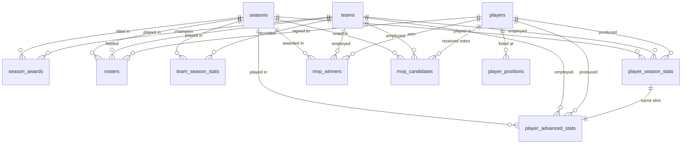

# The `processed` schema

This is the database an analysis actually queries. It holds the cleaned
Basketball-Reference data — 11 tables, one per file in `data/processed/` — in a
PostgreSQL schema called `processed`.

* **Built by:** `python db_setup.py`, which creates the `nba_analysis`
  database, runs `sql/processed/00_schema.sql` then `sql/processed/10_indexes.sql`,
  and `COPY`s each CSV into its table.
* **Where the data came from:** `cleaning/` turns `data/raw/` into
  `data/processed/`. Every decision it makes is recorded in
  [`cleaning_changes.md`](cleaning_changes.md).
* **The DDL is the source of truth.** If this document and
  `sql/processed/00_schema.sql` ever disagree, the DDL is what shipped.

Currently enforced: **11 primary keys, 21 foreign keys, 22 check constraints,
16 secondary indexes.** No constraint is disabled, deferred or `NOT VALID` —
the data satisfies its own keys, so nothing had to be relaxed to load it.

---

## How the tables fit together



Three **dimensions** — `players`, `teams`, `seasons` — answer *who / which club
/ which year*. Everything else is a **fact**: something that happened, pointing
back at those three.

| Table | Rows | Grain — one row is... | Covers |
| --- | ---: | --- | --- |
| `teams` | 75 | one franchise (or franchise era) | all of NBA/BAA/ABA history |
| `players` | 1,989 | one player | everyone referenced anywhere |
| `seasons` | 80 | one season | 1946-47 → 2025-26 |
| `player_positions` | 1,643 | one listed position for one player | the 1,175 players with a bio |
| `season_awards` | 88 | one season in one league | 1946-47 → 2024-25 |
| `rosters` | 1,873 | one player on one team in one season | champions' rosters + all of 2025-26 |
| `player_season_stats` | 5,025 | one player-season **stint** | 2018-19 → 2024-25 |
| `player_advanced_stats` | 5,025 | the same stint, advanced metrics | 2018-19 → 2024-25 |
| `team_season_stats` | 1,693 | one team-season | 1949-50 → 2025-26 |
| `mvp_winners` | 70 | one season's MVP | 1955-56 → 2024-25 |
| `mvp_candidates` | 85 | one player on one MVP ballot | 2018-19 → 2024-25 |

---

## Five conventions that apply everywhere

**1. `season` is the ending year.** The 2024-25 season is stored as `2025`.
Every table names the column `season` and every one of them is a foreign key
to `seasons`. `seasons.season_label` gives you `'2024-25'` when you need to
print it.

**2. `team_id = 'tot'` is not a team.** Basketball-Reference gives a player who
was traded mid-season one extra *combined* row under the pseudo-team `TOT`.
`teams` carries a genuine row for it, flagged `is_aggregate = true`, so those
facts have a valid team to point at. **Exclude `is_aggregate` teams before
counting anything per franchise.**

**3. Use `where is_primary` for per-player questions.** In the two player stat
tables a traded player has several rows (see the `stint` note below).
`is_primary` marks exactly one row per player-season — the combined row where
one exists, otherwise the player's only row. Filtering on it gives 3,884 rows,
one per player-season, with no double counting.

**4. Shooting percentages are 0-1 fractions; advanced percentages are 0-100.**
`player_season_stats.field_goal_pct` of `0.487` means 48.7%.
`player_advanced_stats.usage_percentage` of `28.4` means 28.4%. That split
comes from the two source pages and is preserved rather than silently
harmonised. The column types show which is which: `numeric(5,3)` is a
fraction, `numeric(5,1)` is a one-decimal figure.

**5. Missing means missing.** Nothing is filled with a placeholder. A NULL is
either "the era did not record this statistic" or "we never scraped this
player's bio page" — both are explained per table below.

---

## Dimensions

### `teams` — every franchise ever referenced

Primary key `team_id`.

| Column | Type | Null? | Meaning |
| --- | --- | --- | --- |
| `team_id` | varchar(4) | no | Basketball-Reference's lower-cased 3-letter code (`chi`, `lal`). **PK** |
| `team_name` | text | no | Club name as the source writes it. Not unique: five names are shared by two franchise eras (`bal`/`blb`, `chh`/`cho`, `den`/`dnn`, `ind`/`ina`, `nyn`/`nya`). |
| `is_aggregate` | boolean | no | True only for `tot`, the traded-player season total. Never a real club. |
| `has_detail` | boolean | no | True when the team has at least one row in `team_season_stats` (68 of 75). The seven without are the six ABA clubs known only from championship rosters, plus `tot`. |

### `players` — every player referenced anywhere

Primary key `player_id`.

The important thing to know: **1,175 of the 1,989 players were scraped with a
full bio page; the other 814 are known only by their id and (usually) name.**
They are here because a roster, a box score or an MVP award refers to them, and
the foreign keys would otherwise fail. `has_bio` tells the two apart, and every
attribute column below is NULL for the 814. Michael Jordan (`jordami01`) is one
of them: present, named, five MVPs recorded, no height or birth date.

| Column | Type | Null? | Meaning |
| --- | --- | --- | --- |
| `player_id` | varchar(12) | no | Basketball-Reference id, lower-cased (`jordami01`). **PK** |
| `player_name` | text | yes | NULL for four MVP winners whose name appears nowhere in the raw data (`barklch01`, `iversal01`, `malonka01`, `nashst01`). |
| `has_bio` | boolean | no | True when the bio page was scraped. **All columns below are NULL when this is false** — a check constraint enforces it. |
| `primary_position` | varchar(2) | yes | `PG`/`SG`/`SF`/`PF`/`C`. Same as slot 1 in `player_positions`, kept here for convenience. |
| `shoots` | varchar(8) | yes | `right`, `left` or `both`. |
| `height_cm` | numeric(5,1) | yes | Centimetres, one decimal. |
| `weight_kg` | numeric(5,1) | yes | Kilograms, one decimal. |
| `birth_year`, `birth_month`, `birth_day` | integer | yes | The source's three separate fields. |
| `birth_date` | date | yes | The same fact as one date. Both forms are kept; they always agree. |
| `college` | text | yes | NULL for the 169 players who never attended one. |
| `experience_seasons` | integer | yes | Seasons of NBA experience as of the scrape. |
| `nba_debut_date` | date | yes | First NBA game. |
| `nba_debut_year` | integer | yes | Same date as a year. |
| `draft_year` | integer | yes | Draft class. |
| `draft_team_name` | text | yes | Drafting franchise as free text — **not** a `team_id`. The source names the club as it was called on draft night. |
| `draft_round` | integer | yes | NULL for the 424 undrafted players (of those with a bio). |
| `draft_round_pick` | integer | yes | Pick number within the round. |
| `draft_overall_pick` | integer | yes | Overall pick number. |
| `career_games` | integer | yes | Career totals below are present for 569 players — the source only shows them on some bio pages. |
| `career_points` | numeric(5,1) | yes | Career points **per game**, not a total. |
| `career_total_rebound_pct` | numeric(5,1) | yes | **Misnamed.** Career rebounds **per game**, not a percentage — Michael Jordan's 6.2 is 6.2 rebounds a game. The name comes from the original scrape and is kept so the pipeline's column names stay consistent end to end. |
| `career_assists_pct` | numeric(5,1) | yes | **Misnamed** in the same way: career assists **per game**. Jordan's 5.3 is 5.3 assists a game. |
| `career_field_goal_pct` | numeric(5,1) | yes | Career FG%, 0-100 on this table. |
| `career_three_point_pct` | numeric(5,1) | yes | Career 3P%, 0-100. |
| `career_free_throw_pct` | numeric(5,1) | yes | Career FT%, 0-100. |
| `career_effective_fg_pct` | numeric(5,1) | yes | Career eFG%, 0-100. |
| `career_per` | numeric(5,1) | yes | Player Efficiency Rating; 15.0 is league average. |
| `career_win_shares` | numeric(5,1) | yes | Career total Win Shares (a cumulative count of wins produced). |

> The `career_*` percentages here are on a 0-100 scale, unlike the per-season
> shooting percentages in `player_season_stats`. That is how the bio page
> reports them.

### `seasons` — one row per season, 1946-47 to 2025-26

Primary key `season`.

| Column | Type | Null? | Meaning |
| --- | --- | --- | --- |
| `season` | integer | no | Ending year. 2025 = the 2024-25 season. **PK** |
| `season_label` | varchar(8) | no | `'2024-25'`, for display. |
| `start_year` | integer | no | Always `season - 1`; a check constraint enforces it. |
| `has_awards` | boolean | no | True when the season has a row in `season_awards` (79 of 80). |

---

## Children of the dimensions

### `player_positions` — the positions a player is listed at

Primary key `(player_id, slot)`. Foreign key `player_id → players`.

One row per position instead of six repeating columns. Slot 1 is the primary
position; a player listed at three positions has three rows.

| Column | Type | Null? | Meaning |
| --- | --- | --- | --- |
| `player_id` | varchar(12) | no | **PK**, FK → `players` |
| `slot` | integer | no | 1 = primary, 2 = secondary, and so on. **PK** |
| `position` | varchar(16) | no | Spelled out as the bio page writes it: `Point Guard`. |
| `position_code` | varchar(2) | no | The same position as `PG`/`SG`/`SF`/`PF`/`C`, so it joins to the season tables. |

### `season_awards` — champion and award leaders per season

Primary key `(season, league)`. Foreign keys `season → seasons`,
`champion_team_id → teams`.

The key is composite because the nine ABA seasons have **two** champions — one
NBA, one ABA — in the same year.

| Column | Type | Null? | Meaning |
| --- | --- | --- | --- |
| `season` | integer | no | **PK**, FK → `seasons` |
| `league` | varchar(4) | no | `NBA`, `ABA` or `BAA`. **PK** |
| `champion_team_id` | varchar(4) | no | The title winner, as a real `team_id`. Never NULL — all 88 champions resolve. FK → `teams` |
| `rookie_of_the_year` | text | yes | **Display text, not a key.** The source only gives an abbreviated name (`"S. Castle"`), which cannot be joined to a player. |
| `most_points` | text | yes | Scoring leader, display text. |
| `most_rebounds` | text | yes | Rebounding leader, display text. |
| `most_assists` | text | yes | Assist leader, display text. |
| `most_winshares` | text | yes | Win Shares leader, display text. |

> Where the same fact exists with a real key, use that instead: the season MVP
> is in `mvp_winners` with a proper `player_id`.

---

## Facts

### `rosters` — who was on which roster

Primary key `(season, team_id, player_id)`. Foreign keys to all three
dimensions.

**Read this before using the table.** It is *not* a league-wide roster history.
The scrape collected the **champion team's roster for every season from 1946-47
onwards** (both champions in the ABA seasons), plus all 30 rosters of the
current 2025-26 season. So a query like "average height per team per season"
answers a question about champions, not about the league.

| Column | Type | Null? | Meaning |
| --- | --- | --- | --- |
| `season` | integer | no | **PK**, FK → `seasons` |
| `team_id` | varchar(4) | no | **PK**, FK → `teams` |
| `player_id` | varchar(12) | no | **PK**, FK → `players` |
| `player_name` | text | no | Name as printed on the roster page. |
| `roster_note` | varchar(8) | yes | The annotation the source appends to a name, e.g. `TW` for a two-way contract. NULL for 1,793 of 1,873 entries. |
| `position` | varchar(4) | no | As printed: `G`, `F-C`, `PG`, ... |
| `position_primary` | varchar(2) | no | First position from that string. |
| `position_secondary` | varchar(2) | yes | Second position, NULL when the player is listed at one. |
| `height_cm` | numeric(5,1) | no | Centimetres. |
| `weight_kg` | numeric(5,1) | yes | Kilograms; missing for 96 older entries. |
| `birth_date` | date | yes | Missing for one entry. |
| `birth_country` | varchar(2) | no | Two-letter country code — the nationality field. |
| `experience_seasons` | integer | no | Seasons of NBA experience **before** this one. **0 means rookie** (the source writes `R`). |
| `college` | text | yes | Missing for 165 entries. |

### `player_season_stats` — season box-score totals per player

Primary key `(season, player_id, stint)`. Foreign keys `season → seasons`,
`player_id → players`, `team_id → teams`.

Seasons 2018-19 through 2024-25. **Season totals, not per-game averages** —
divide by `games_played` yourself.

**The `stint` column is what makes the key three parts wide:**

| Situation | Rows for that player-season |
| --- | --- |
| Played all season for one club | one row, `stint = 1`, `is_primary = true` |
| Traded once | three rows: `stint = 0` (combined, `team_id = 'tot'`, `is_primary = true`), `stint = 1` (first club), `stint = 2` (second club) |

`stint = 0` and `team_id = 'tot'` are the same fact and a check constraint
requires them to agree. There are 551 of each. `where is_primary` collapses the
table back to 3,884 rows, exactly one per player-season.

| Column | Type | Null? | Meaning |
| --- | --- | --- | --- |
| `season` | integer | no | **PK**, FK → `seasons` |
| `player_id` | varchar(12) | no | **PK**, FK → `players` |
| `stint` | integer | no | 0 = season total, 1..n = per-club rows in source order. **PK** |
| `is_primary` | boolean | no | Marks the one row per player-season to use for per-player analysis. |
| `team_id` | varchar(4) | no | FK → `teams`; `'tot'` on the combined rows. |
| `rank` | integer | no | The source page's display order. Not a fact about the player — don't rank by it. |
| `age` | integer | no | Age during that season. |
| `position` | varchar(2) | no | Position played that season: `PG`/`SG`/`SF`/`PF`/`C`. |
| `games_played` | integer | no | Games appeared in. |
| `games_started` | integer | no | Of those, games started. Never exceeds `games_played` (enforced). |
| `minutes_played` | integer | no | Total minutes. |
| `field_goals_made` / `_attempted` | integer | no | Made never exceeds attempted (enforced, all four shot types). |
| `field_goal_pct` | numeric(5,3) | yes | 0-1 fraction. **NULL, not 0, when the player took no shots of that kind.** |
| `three_pointers_made` / `_attempted` | integer | no | Three-point shooting. |
| `three_point_pct` | numeric(5,3) | yes | 0-1 fraction; NULL for 304 rows with no attempts. |
| `two_pointers_made` / `_attempted` | integer | no | Two-point shooting. |
| `two_point_pct` | numeric(5,3) | yes | 0-1 fraction. |
| `effective_fg_pct` | numeric(5,3) | yes | FG% weighted for a three being worth more than a two, so it **can exceed 1.0**. |
| `free_throws_made` / `_attempted` | integer | no | Free throws. |
| `free_throw_pct` | numeric(5,3) | yes | 0-1 fraction; NULL for 340 rows. |
| `offensive_rebounds`, `defensive_rebounds`, `total_rebounds` | integer | no | Rebounds. Offensive + defensive always equals total. |
| `assists`, `steals`, `blocks`, `turnovers`, `personal_fouls`, `points` | integer | no | The rest of the box score, as season totals. |
| `triple_doubles` | integer | no | Triple-doubles recorded that season. |

### `player_advanced_stats` — the same stints, advanced metrics

Primary key `(season, player_id, stint)`. Foreign key
`(season, player_id, stint) → player_season_stats`, plus the three usual
dimension keys.

Same 5,025 rows, same grain, same `stint` / `is_primary` / `'tot'` rules. The
composite foreign key means an advanced row can never exist without its
box-score row, so the two tables always join 1:1.

`age`, `position`, `games` and `minutes_played` are deliberately **not**
repeated here — they were verified identical to `player_season_stats`, so join
to that table for them.

> **Scale:** the `*_percentage` columns below are on a **0-100** scale.

| Column | Type | Null? | Meaning |
| --- | --- | --- | --- |
| `season`, `player_id`, `stint` | | no | **PK**, FK → `player_season_stats` |
| `is_primary` | boolean | no | As in the box-score table. |
| `team_id` | varchar(4) | no | FK → `teams`; `'tot'` on the combined rows. |
| `player_efficiency_rate` | numeric(5,1) | no | PER — per-minute production. League average is 15.0 by construction. |
| `true_shooting_percentage` | numeric(5,3) | yes | TS% — shooting efficiency counting twos, threes and free throws. A **0-1 fraction**; can exceed 1.0. |
| `three_point_attempt_rate` | numeric(5,3) | yes | Share of the player's shots that were threes, 0-1. NULL when he took no shots. |
| `free_throw_attempt_rate` | numeric(5,3) | yes | Free throws drawn per field-goal attempt. Not capped at 1. |
| `offensive_rebound_percentage` | numeric(5,1) | no | ORB% — share of available offensive rebounds collected while on the floor, 0-100. |
| `defensive_rebound_percentage` | numeric(5,1) | no | DRB%, 0-100. |
| `total_rebound_percentage` | numeric(5,1) | no | TRB%, 0-100. |
| `assist_percentage` | numeric(5,1) | no | AST% — share of teammates' field goals assisted, 0-100. |
| `steal_percentage` | numeric(5,1) | no | STL% — steals per opponent possession, 0-100. |
| `block_percentage` | numeric(5,1) | no | BLK% — blocks per opponent two-point attempt, 0-100. |
| `turnover_percentage` | numeric(5,1) | yes | TOV% — turnovers per possession used. NULL for 33 rows. |
| `usage_percentage` | numeric(5,1) | no | USG% — share of team possessions the player finished, 0-100. |
| `offensive_win_shares` | numeric(5,1) | no | Wins credited to offence. Can be negative. |
| `defensive_win_shares` | numeric(5,1) | no | Wins credited to defence. |
| `win_shares` | numeric(5,1) | no | Offensive + defensive. |
| `win_shares_per_48_minutes` | numeric(5,3) | no | Win Shares normalised for playing time. |
| `offensive_box_plus_minus` | numeric(5,1) | no | OBPM — points per 100 possessions above a league-average player, offence. |
| `defensive_box_plus_minus` | numeric(5,1) | no | DBPM — the defensive counterpart. |
| `box_plus_minus` | numeric(5,1) | no | BPM — the two combined. |
| `value_over_replacement_player` | numeric(5,1) | no | VORP — total contribution above a replacement-level player. |

### `team_season_stats` — team totals per season

Primary key `(season, team_id)`. Foreign keys `season → seasons`,
`team_id → teams`.

Seasons 1949-50 through 2025-26, season totals. **Two traps:**

1. **The 30 rows for 2025-26 have `games = 0`** — the season has not been
   played. Always `where games > 0` before averaging over team-seasons.
2. **NULLs mark eras, not gaps in the scrape.** The league did not record every
   statistic from the start:

   | Column | First season with complete data |
   | --- | --- |
   | `total_rebounds` | 1950-51 |
   | `minutes_played` | 1964-65 |
   | `turnovers` | 1970-71 (one lone team has it in each of the two seasons before) |
   | `offensive_rebounds`, `defensive_rebounds`, `steals`, `blocks` | 1973-74 |
   | `three_pointers_made` / `_attempted` / `three_point_pct` | 1979-80 |

   One further row (`blb`, 1954-55) has no statistics at all: the franchise
   folded mid-season. It is the only NULL in columns such as `points` and
   `games`.

| Column | Type | Null? | Meaning |
| --- | --- | --- | --- |
| `season` | integer | no | **PK**, FK → `seasons` |
| `team_id` | varchar(4) | no | **PK**, FK → `teams` |
| `rank` | integer | no | The source page's display rank within the season. |
| `games` | integer | yes | Games played. 0 = season not yet played. |
| `minutes_played` | integer | yes | Team minutes. |
| `field_goals_made` … `points` | integer / numeric | yes | The same box-score columns as the player table, aggregated to the team. Percentages are `numeric(5,3)` 0-1 fractions. |

### `mvp_winners` — the Michael Jordan Trophy

Primary key `(season, league)`. Foreign keys `season → seasons`,
`player_id → players`, `team_id → teams`.

One row per season MVP from 1955-56 to 2024-25, with the **per-game** line the
award was won on. This is the table the "Michael Jordan Trophy list" questions
run against; counting `player_id` gives a player's MVP tally.

| Column | Type | Null? | Meaning |
| --- | --- | --- | --- |
| `season` | integer | no | **PK**, FK → `seasons` |
| `league` | varchar(4) | no | `NBA` for every current row. **PK** |
| `player_id` | varchar(12) | no | FK → `players`. 37 distinct players won these 70 awards; 26 of them have `has_bio = false`, covering 52 of the rows. |
| `team_id` | varchar(4) | no | FK → `teams` |
| `age` | integer | no | Age during the MVP season. |
| `games` | integer | no | Games played. |
| `minutes_per_game` … `assists_per_game` | numeric(5,1) | no | Per-game averages. |
| `steals_per_game`, `blocks_per_game` | numeric(5,1) | yes | **NULL for 1955-56 to 1972-73** — not recorded before 1973-74. |
| `field_goal_pct`, `free_throw_pct` | numeric(5,3) | no | 0-1 fractions. |
| `three_point_pct` | numeric(5,3) | yes | **NULL for 1955-56 to 1978-79** — no three-point line before 1979-80. |
| `win_shares` | numeric(5,1) | no | Win Shares that season. |
| `win_shares_per_48` | numeric(5,3) | no | Normalised for playing time. |

### `mvp_candidates` — the MVP ballot

Primary key `(season, player_id)`. Foreign keys `season → seasons`,
`player_id → players`, `team_id → teams`.

Everyone who received an MVP vote from 2018-19 to 2024-25. The winner also
appears here, at rank 1.

| Column | Type | Null? | Meaning |
| --- | --- | --- | --- |
| `season` | integer | no | **PK**, FK → `seasons` |
| `player_id` | varchar(12) | no | **PK**, FK → `players` |
| `rank` | integer | no | Final ballot position. |
| `tie` | boolean | no | True when the position was shared. The source writes `"10T"`; the number and the tie flag are stored separately. |
| `age` | integer | no | Age that season. |
| `team_id` | varchar(4) | yes | FK → `teams`. NULL for two candidates the source lists without a club. |
| `first_place_votes` | integer | no | First-place votes received. |
| `points_won` | integer | no | Voting points earned. Never exceeds `points_max` (enforced). |
| `points_max` | integer | no | Maximum available that season. |
| `share` | numeric(5,3) | no | `points_won / points_max`; 1.0 is a unanimous MVP. |
| `games` | integer | no | Games played. |
| `mp`, `pts`, `trb`, `ast`, `stl`, `blk` | numeric(5,1) | no | Per-game minutes, points, rebounds, assists, steals, blocks — abbreviated as the source names them. |
| `fg_pct`, `ft_pct` | numeric(5,3) | no | 0-1 fractions. |
| `three_pct` | numeric(5,3) | yes | NULL for one candidate with no attempts. |
| `ws` | numeric(5,1) | no | Win Shares. |
| `ws_per_48` | numeric(5,3) | no | Win Shares per 48 minutes. |

---

## Indexes

`sql/processed/10_indexes.sql` adds 16 indexes on top of the primary keys.
Every primary key already indexes its own columns in order, so the extra ones
cover two things the PKs miss: **the child side of each foreign key**
(PostgreSQL does not index it automatically) and **the `where is_primary`
filter**, which gets a partial index storing only the 3,884 rows that pass.

These tables are small — the largest is 5,025 rows — so PostgreSQL will often
scan them anyway. The indexes are cheap, they keep foreign-key maintenance
fast, and they record which columns the analysis joins on.

---

## Rebuilding

```bash
python -m cleaning.run_all   # data/raw -> data/processed
python db_setup.py           # data/processed -> PostgreSQL (asks to confirm)
```

`db_setup.py` drops and recreates the whole database, so it is safe to run
repeatedly and always produces the same result. `sql/processed/00_schema.sql`
begins with `drop schema if exists processed cascade`, so applying the schema
on its own is also repeatable.

`rebuild.py` builds the schemas *derived* from `processed` (currently
`sql/analyst_ready/`). It loads no data and never touches `processed`, so it is
the fast way to iterate on queries once the data is in.
